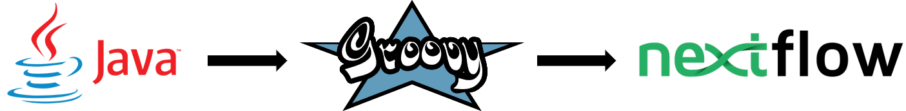
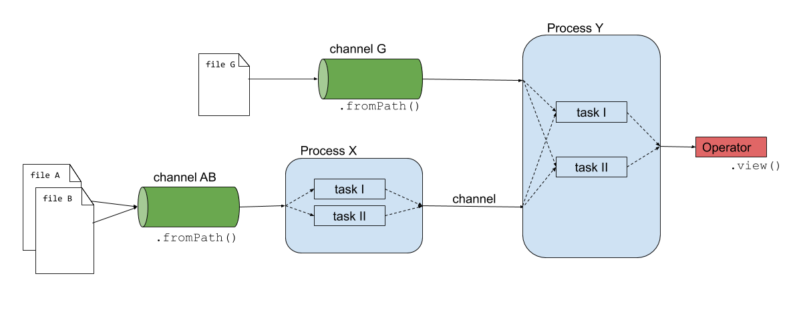
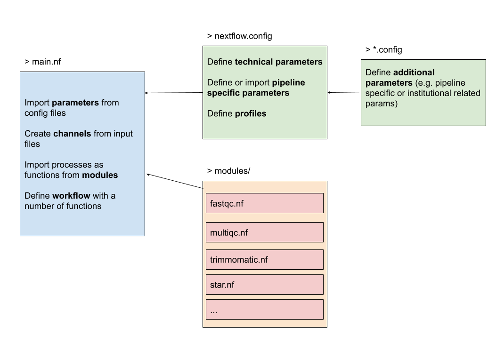

<!--

author:   Kobe Lavaerts, Tuur Muyldermans, Kris Davie, Steff Taelman
email:    training@vib.de
version:  1.0.0
language: en
narrator: UK English Female

icon:     https://vib.be/sites/vib.sites.vib.be/files/logo_VIB_noTagline.svg

comment:  This document shall provide an entire compendium and course on the
          development of Open-courSes with [LiaScript](https://LiaScript.github.io).
          As the language and the systems grows, also this document will be updated.
          Feel free to fork or copy it, translations are very welcome...

script:   https://cdn.jsdelivr.net/chartist.js/latest/chartist.min.js
          https://felixhao28.github.io/JSCPP/dist/JSCPP.es5.min.js

link:     https://cdn.jsdelivr.net/chartist.js/latest/chartist.min.css
link:     https://cdnjs.cloudflare.com/ajax/libs/animate.css/4.1.1/animate.min.css
link:     https://raw.githubusercontent.com/vibbits/material-liascript/master/img/org.css
link:     https://cdnjs.cloudflare.com/ajax/libs/font-awesome/5.11.2/css/all.min.css
link:     https://fonts.googleapis.com/css2?family=Saira+Condensed:wght@300&display=swap
link:     https://fonts.googleapis.com/css2?family=Open+Sans&display=swap
link:     https://raw.githubusercontent.com/vibbits/material-liascript/master/vib-styles.css

tutor:    Introduction to Nextflow
edition:  5th

@JSONLD
<script run-once>
  let json = @0

  const script = document.createElement('script');
  script.type = 'application/ld+json';
  script.text = JSON.stringify(json);

  document.head.appendChild(script);

  // this is only needed to prevent and output,
  // as long as the result of a script is undefined,
  // it is not shown or rendered within LiaScript
  console.debug("added json to head")
</script>
@end

orcid:    [@0](@1)<!--class="orcid-logo-for-author-list"-->
-->

# Nextflow workshop

<section>

Hello and welcome to our @tutor workshop! We are very happy to have you here. This repository contains the data, scripts, documentation and relevant information for the website containing the training materials.

This is the @edition edition of this workshop, jointly organised by VIB and ELIXIR.


Let's start!

> We are using the interactive Open Educational Resource online/offline course infrastructure called LiaScript.
> It is a distributed way of creating and sharing educational content hosted on github.
> To see this document as an interactive LiaScript rendered version, click on the
> following link/badge: [LiaScript](https://liascript.github.io/course/?https://raw.githubusercontent.com/vibbits/nextflow-workshop/main/README.md)

## General context

This repository contains the materials (exercises) for the workshop on Nextflow on 10-11th November 2024.

The **presentations** which goes alongside this material can be found [in the Lesson overview: Slides](#2) .

## Proposed Schedule

Schedule day 1:

- 9:30 - 11:00 - Introduction to Nextflow: Building Blocks
- 11:00 - 11:15 - break
- 11:15 - 12:45 - Processes and Workflows
- 12:45 - 13:45 - lunch
- 13:45 - 15:15 - Creating our first pipeline
- 15:15 - 15:30 - break
- 15:30 - 17:00 - Modules and Subworkflow

Schedule day 2:

- 9:30 - 10:45 - recap day 1
   - Config files, Containers and Reports
- 10:45 - 11:00 - break
- 11:00 - 12:15 - Exercise
- 12:15 - 13:15 - lunch
- 13:15 - 15:00 - Project Challenge
- 15:15 - 15:30 - break
- 15:30 - 17:00 - Project Challenge

</section>

```json   @JSONLD
{
  "@context": "https://schema.org/",
  "@type": "LearningResource",
  "@id": "https://elixir-europe-training.github.io/ELIXIR-TrP-TeSS/",
  "http://purl.org/dc/terms/conformsTo": {
    "@type": "CreativeWork",
    "@id": "https://bioschemas.org/profiles/TrainingMaterial/1.0-RELEASE"
  },
  "description": "Introduction to Docker and Apptainer",
  "keywords": "Docker, Containers, Recipes, Singularity",
  "name": "Introduction to Docker and Apptainer",
  "license": "https://creativecommons.org/licenses/by/4.0/",
  "educationalLevel": "beginner",
  "competencyRequired": "none",
  "teaches": [
    "Define what containers are and articulate the differences between Docker and Singularity.",
   "Identify the components of a Docker recipe and correlate with the layers within a Docker image.",
   "List the benefits of containerization, considering reproducibility, usage and installation.",
   "Recognize the use cases where Docker is the preferred method for deploying applications.",
    "Discuss case studies to justify the selection of Docker or Singularity for specific deployment scenarios."
  ],
  "audience": "researchers",
  "inLanguage": "en-US",
  "learningResourceType": [
    "tutorial"
  ],
  "author": [
    {
      "@type": "Person",
      "name": "Bruna Piereck"
    },
    {
      "@type": "Person",
      "name": "Alexander Botzki"
    }
  ],
  "contributor": [
    {
      "@type": "Person",
      "name": "Christof De Bo"
    }
  ]
}
```

# Lesson overview

> <i class="fa fa-lock"></i> **License:** [Creative Commons Attribution 4.0 International  License](https://creativecommons.org/licenses/by/4.0/deed.en)
>
> <i class="fa fa-user"></i> **Target Audience:** Researchers
>
> <svg xmlns="http://www.w3.org/2000/svg" height="14" width="16" viewBox="0 0 576 512"><!--!Font Awesome Free 6.5.1 by @fontawesome - https://fontawesome.com License - https://fontawesome.com/license/free Copyright 2023 Fonticons, Inc.--><path d="M384 64c0-17.7 14.3-32 32-32H544c17.7 0 32 14.3 32 32s-14.3 32-32 32H448v96c0 17.7-14.3 32-32 32H320v96c0 17.7-14.3 32-32 32H192v96c0 17.7-14.3 32-32 32H32c-17.7 0-32-14.3-32-32s14.3-32 32-32h96V320c0-17.7 14.3-32 32-32h96V192c0-17.7 14.3-32 32-32h96V64z"/></svg> **Level:** Beginner
>
> <i class="fa fa-arrow-left"></i> **Prerequisites**
> To be able to follow this course, learners should have knowledge in:
>
> 1. Knowledge of Command line Interface is a plus
>
> <i class="fa fa-bookmark"></i> **Description** This course aims to get you familiarized with Nextflow. After this course you should be able to understand workflow pipelines that are written in Nextflow and write simple pipelines yourself.
>
> <i class="fa fa-arrow-right"></i> **Learning Outcomes:**
> By the end of the course, learners will be able to:
>
> 1. Understand Nextflow's basic concepts & syntax: channels, processes, modules, workflows, etc.
> 2. Execute local and publicly available pipelines with different executors and environments
> 3. Write and run Nextflow pipelines
> 4. Write and modify config files for storing parameters related to computing hardware as well as pipeline dependent parameters
>
>> Check more about [Bloom's taxonomy](https://cft.vanderbilt.edu/guides-sub-pages/blooms-taxonomy/) to categorize the levels in educational goals
>
> <i class="fa fa-hourglass"></i> **Time estimation**: 16 hours
>
> <i class="fa fa-asterisk"></i> **Requirements:** The (technical) installation requirements are described in the Chapters overview section Getting ready.
>
> <i class="fa fa-envelope-open-text"></i> **Supporting Materials**:
>
> 1. [Exercises and solutions](https://github.com/vibbits/nextflow-workshop)
> 2. [Slides day 1+2](https://docs.google.com/presentation/d/1sv79FpO-kN8BO271SG5oDHrVJBEdJGnh0_TG8qzDyGI/edit?usp=sharing)
>
> <i class="fa fa-life-ring"></i> **Acknowledgement**:
>
> * [ELIXIR Belgium](https://www.elixir-belgium.org/)
> * [VIB Technologies](https://www.vib.be/)
> * [UZ Ghent](https://www.uzgent.be/)
>
> <i class="fa fa-money-bill"></i> **Funding:** This project has received funding from VIB and ELIXIR Belgium.
>
> <i class="fa fa-anchor"></i> **PURL**:


# Authors and Contributors

Authors

- [Bruna Piereck](@[orcid](https://orcid.org/0000-0001-5958-0669)
- [Alexander Botzki](@[orcid](https://orcid.org/0000-0001-6691-4233)
- [Tuur Muyldermans]([orcid](https://orcid.org/0000-0002-3926-7293)
- @[orcid(Kris Davie)](https://orcid.org/0000-0003-2182-1249)
- @[orcid(Kobe Lavaerts)](https://orcid.org/0000-0003-0490-5969)
- @[orcid(Tuur Muyldermans)](https://orcid.org/0000-0002-3926-7293)
- @[orcid(Steff Taelman)](https://orcid.org/0000-0002-2685-4130)
- Nicolas Vannieuwkerke <!-- TODO Add Orcid once Nicolas has one -->

Contributors

- we welcome contributors for these materials

## Citing this lesson

Please cite as:

  1. to be added once we have released the first version

# Chapters List

| Chapter | Title                                                   |
| :---- | :------------------------------------------------         |
| 0     | [Getting Ready](#get-ready-for-the-course)  |
| 1     | [Building blocks](https://liascript.github.io/course/?https://raw.githubusercontent.com/vibbits/nextflow-workshop/refs/heads/main/chapters/chapter01.md)  |
| 2     | [Executing pipelines](https://liascript.github.io/course/?https://raw.githubusercontent.com/vibbits/nextflow-workshop/refs/heads/main/chapters/chapter02.md)  |
| 3     | [Creating first pipeline](https://liascript.github.io/course/?https://raw.githubusercontent.com/vibbits/nextflow-workshop/refs/heads/main/chapters/chapter03.md)  |
| 4     | [Configuration files](https://liascript.github.io/course/?https://raw.githubusercontent.com/vibbits/nextflow-workshop/refs/heads/main/chapters/chapter04.md)  |
| 5     | [Creating reports](https://liascript.github.io/course/?https://raw.githubusercontent.com/vibbits/nextflow-workshop/refs/heads/main/chapters/chapter05.md)  |
| 6     | [Project](https://liascript.github.io/course/?https://raw.githubusercontent.com/vibbits/nextflow-workshop/refs/heads/main/chapters/chapter06.md)  |

# References

Here are some great tips for learning and to get inspired for your own use:

* [EC ERA Forum doc - CC-BY](https://research-and-innovation.ec.europa.eu/document/download/2b6cf7e5-36ac-41cb-aab5-0d32050143dc_en?filename=ec_rtd_ai-guidelines.pdf)
* [Library Toronto](https://onesearch.library.utoronto.ca/copyright/generative-ai-tools-and-copyright-considerations)
* [tools list Georgetown](https://guides.library.georgetown.edu/ai/tools)
* [UWaterloo CA June 2024](https://uwaterloo.ca/associate-vice-president-academic/sites/default/files/uploads/documents/genai-overview-final-june-2024.pdf)
* [University framework on GenAI for research](https://arxiv.org/html/2404.19244v1)
* [prompting guide from Cape Town university](https://docs.google.com/document/d/1EHMRP4kxADwLsOkHwAbUWQaGD8EGfQ3D/edit)
* [guide for ethical use in research](https://docs.google.com/document/d/14XaTVheTtr7XpDWX33OthT4piMHnYUfl/edit)
* [genAI for marketing content creation](https://sciendo.com/article/10.2478/nimmir-2024-0002)

# About us

*About ELIXIR Training Platform*

The ELIXIR Training Platform was established to develop a training community that spans all ELIXIR member states (see the list of Training Coordinators). It aims to strengthen national training programmes, grow bioinformatics training capacity and competence across Europe, and empower researchers to use ELIXIR's services and tools.

One service offered by the Training Platform is TeSS, the training registry for the ELIXIR community. Together with ELIXIR France and ELIXIR Slovenia, VIB as lead node for ELIXIR Belgium is engaged in consolidating quality and impact of the TeSS training resources (2022-23) (https://elixir-europe.org/internal-projects/commissioned-services/2022-trp3).

The Training eSupport System was developed to help trainees, trainers and their institutions to have a one-stop shop where they can share and find information about training and events, including training material. This way we can create a catalogue that can be shared within the community. How it works is what we are going to find out in this course.

*About VIB and VIB Technologies*

VIB is an entrepreneurial non-profit research institute, with a clear focus on groundbreaking strategic basic research in life sciences and operates in close partnership with the five universities in Flanders – Ghent University, KU Leuven, University of Antwerp, Vrije Universiteit Brussel and Hasselt University.

As part of the VIB Technologies, the 12 VIB Core Facilities, provide support in a wide array of research fields and housing specialized scientific equipment for each discipline. Science and technology go hand in hand. New technologies advance science and often accelerate breakthroughs in scientific research. VIB has a visionary approach to science and technology, founded on its ability to identify and foster new innovations in life sciences.

The goal of VIB Technology Training is to up-skill life scientists to excel in the domains of VIB Technologies, Bioinformatics & AI, Software Development, and Research Data Management.

--------------------------------------------

*Editorial team for this course*

Authors: @[orcid(Alexander Botzki)](https://orcid.org/0000-0001-6691-4233), @[orcid(Bruna Piereck)](https://orcid.org/0000-0001-5958-0669)

Technical Editors: Alexander Botzki

## Get ready for the course

Please read this page carefully **before** the start of the workshop.

There are two options for following this workshop:

  1. do the installations yourself & be in control of everything,
  2. use the setup that we have provided with the installations already done.

In the former case, you will have to download [Nextflow](https://www.nextflow.io/docs/edge/getstarted.html) and [Apptainer](https://apptainer.org/). In the latter case, you can follow the instructions below.

### Provided infrastructure

We will be using the Gent section of the [Flemish Supercomputing Center](https://www.vscentrum.be/), you should have already recieved instructions for creating an account. Specifically, we will be using the [Interactive and Debug](https://docs.hpc.ugent.be/Linux/interactive_debug/) cluster. The cluster is already equipped with the latest version of Nextflow, and Apptainer.

To connect to the cluster, there are two options. For the first option, there is no local setup needed, we will use the Web Interface to access the Gent VSC.

#### Option 1: Web Interface

This utilizes the OnDemand infrastructure at the VSC to launch a web-based version of VSCode for us. Using this, we don't need to make any connections to the clutser other than through the browser.

_If you normally use VSCode locally, this setup is completely seperate and won't have your usual extensions etc._

- Navigate to [https://login.hpc.ugent.be/](https://login.hpc.ugent.be/) and login with your credentials.
- Select "Interactive Apps" from the top bar -> "Code Server"
- Fill in the following settings:
  - Cluster: `donphan (interactive/debug)`
  - Time: 12 (hours)
  - Nodes: 1
  - Cores: 8
  - Select Path -> /data/... (on the left)
  - Click "Launch"!
- Wait for your job to start -> "Connect to VS Code"

This runs fully in your browser and will continue to run even when your laptop is off etc. Your job will automatically end after 12 hours. **Make sure to save your work.**

#### Option 2: Local Installation

We will be using an SSH connection in VSCode which we can create by following these instructions:

- Download Visual Studio Code ([link](https://code.visualstudio.com/download))
- Add the following extensions for a seamless integration of Nextflow and the VM in VScode:

  - In VSCode, navigate to the 'Extensions' tab, search for the SSH remote package and install it:
  - 'Remote - SSH' (ms-vscode-remote.remote-ssh).
- Modify your local `.ssh/config` file to add the configuration for the cluster - If you already connect to the Gent VSC with this machine, you don't need to do this

  - `Ctrl-Shift-P` will bring up the "command palette"
  - Type `ssh config` and select the option to modify the configuration file (select the first file)
  - Add the following code to your config file:
```
Host login-gent
    User vscXXXXX # Replace Xs with your VSC ID
    HostName login.hpc.ugent.be
    IdentityFile ~/.ssh/id_rsa # This should be replaced with the path to your private key ( windows users might look like this: C:\Users\KrisDavie\Documents\VSC\vsc_id_rsa)
```
- Start a terminal in VSCode (select Terminal and then New Terminal)
- Connect to the cluster with the following command: `ssh login-gent`
- Optional: Start `screen` or `tmux` and do the following in the new terminal - This will keep your session alive even when you disconnect from the cluster
- Load the modules for connecting to the interactive cluster: `module swap cluster/donphan`
- Start a job using qsub: `qsub -I -l walltime=08:00:00,nodes=1:ppn=8`
- Note the node you are connected to (e.g. `node4006.donphan.os`)
- Add the following code to your config file:
```
Host node4006
    User vscXXXXX # Replace Xs with your VSC ID
    HostName node4006.donphan.os
    ProxyCommand ssh login-gent -W %h:%p
    # On windows you should use
    # ProxyCommand C:\Windows\System32\OpenSSH\ssh.exe login-gent -W %h:%p
```
- Finally you can open a this host in VSCode by typing `Ctrl-Shift-P` and selecting `Remote-SSH: Connect to Host...` and selecting the host you just added.

  - If you didn't run qsub in a screen or tmux session, you will need to use an entire new VSCode window to connect to the host, otherwise when VSCode refreshes, the original connection will be lost and the job will end.

#### Option 3: Custom Installation

You are free to connect to the cluster however you want, but the above 2 methods are the only ones we will support in the session.

### Common Setup

- Install the Nextflow VSCcode Package - This will give you syntax highlighting and linting for Nextflow
- Open a new terminal within VSCode: Terminal -> New Terminal
- Create a new folder for the workshop
- Clone this repository into the folder: `git clone https://github.com/vibbits/nextflow-workshop.git`
- Load the nextflow module: `module load Nextflow/24.10.0`

## Citing this lesson

Please cite as:

  1. Bruna Piereck, Olivier Sand, Yasmine Maes, Alexander Botzki. (2023). The training course about using TeSS (v1.0.0). Zenodo. tbc
  2. Geert van Geest, Elin Kronander, Jose Alejandro Romero Herrera, Nadja Žlender, & Alexia Cardona. (2023). The ELIXIR Training Lesson Template - Developing Training Together (v1.0.0-alpha). Zenodo. https://doi.org/10.5281/zenodo.7913092.

## References

Here are some great tips for learning and to get inspired for writing your own pipelines:

- Nextflow's official documentation ([link](https://www.nextflow.io/docs/latest/index.html))
- Reach out to the community on Slack ([link](https://www.nextflow.io/slack-invite.html))
- Curated collection of patterns ([link](https://github.com/nextflow-io/patterns))
- Workshop focused on DSL2 developed by CRG Bioinformatics Core ([link](https://github.com/biocorecrg/ELIXIR_containers_nextflow))
- Curated ready-to-use analysis pipelines by NF-core ([link](https://nf-co.re/))
- Model example pipeline on Variant Calling Analysis with NGS RNA-Seq data developed by CRG ([link](https://github.com/CRG-CNAG/CalliNGS-NF))
- Tutorial by Andrew Severin ([link](https://bioinformaticsworkbook.org/dataAnalysis/nextflow/02_creatingAworkflow.html#gsc.tab=0))
- Nextflow community basic training ([link](https://training.nextflow.io/basic_training/))

--------------------------------------------

*About ELIXIR Training Platform*

The ELIXIR Training Platform was established to develop a training community that spans all ELIXIR member states (see the list of Training Coordinators). It aims to strengthen national training programmes, grow bioinformatics training capacity and competence across Europe, and empower researchers to use ELIXIR's services and tools.

One service offered by the Training Platform is TeSS, the training registry for the ELIXIR community. Together with ELIXIR France and ELIXIR Slovenia, VIB as lead node for ELIXIR Belgium is engaged in consolidating quality and impact of the TeSS training resources (2022-23) (https://elixir-europe.org/internal-projects/commissioned-services/2022-trp3).

The Training eSupport System was developed to help trainees, trainers and their institutions to have a one-stop shop where they can share and find information about training and events, including training material. This way we can create a catalogue that can be shared within the community. How it works is what we are going to find out in this course.

*About VIB and VIB Technologies*

VIB is an entrepreneurial non-profit research institute, with a clear focus on groundbreaking strategic basic research in life sciences and operates in close partnership with the five universities in Flanders – Ghent University, KU Leuven, University of Antwerp, Vrije Universiteit Brussel and Hasselt University.

As part of the VIB Technologies, the 12 VIB Core Facilities, provide support in a wide array of research fields and housing specialized scientific equipment for each discipline. Science and technology go hand in hand. New technologies advance science and often accelerate breakthroughs in scientific research. VIB has a visionary approach to science and technology, founded on its ability to identify and foster new innovations in life sciences.

The goal of VIB Technology Training is to up-skill life scientists to excel in the domains of VIB Technologies, Bioinformatics & AI, Software Development, and Research Data Management.

--------------------------------------------

*Editorial team for this course*

Authors: @[orcid(Alexander Botzki)](https://orcid.org/0000-0001-6691-4233), @[orcid(Bruna Piereck)](https://orcid.org/0000-0001-5958-0669)

Contributors: Finn Bacall, Aitor Apaolaza, Munazah Andrabi, Chris Child, Carole Goble, Olivier Sand

Technical Editors: Alexander Botzki

License: [](http://creativecommons.org/licenses/by/4.0/)


## Nextflow
This tutorial aims to get you familiarized with Nextflow. After this course you should be able to understand workflow pipelines that are written in Nextflow and write simple pipelines yourself! Here's an overview of the materials that we will cover:

- General introduction to Nextflow
- Building blocks of Nextflow: processes, channels and operators, workflows and modules
- Executing pipelines
- Creating our first Nextflow script(s)
- Managing configurations: parameters, portability, executors

The course materials are focused on the newer version of Nextflow DSL2. This is the newest version of the Nextflow language and the *de-facto* standard for writing new pipelines in Nextflow. In fact, DSL1 is supposed to be fading out and chances are that the support for DSL1 will be gone within a near future. Must you have any questions regarding pipelines written in DSL1, feel free to ask any questions during the workshop.


# Building blocks
In the first chapter we will elaborate on how Nextflow is designed, its advantages and disadvantages, the basic components, etc.

In the `data/` folder we have already installed some data for you to use in the following exercises.

## Introduction
Writing pipelines to automate processes is not something new, Bash scripts are probably one of the oldest forms of pipelines where we concatenate processes. Let's have a look at an example:

```bash
#!/bin/bash

blastp -query sample.fasta -outfmt 6 \
	| head -n 10 \
	| cut -f 2 \
	| blastdbcmd -entry - > sequences.txt
```

Starting with a shebang line, the `blastp` command is piped through multiple times to eventually result in an output file `sequences.txt`.

<details>

<summary>What is the downside of similar relatively simple pipelines?</summary>

There are a couple of suboptimal things happening here:

- Will it use the available resources optimally?
- Which versions of the tools are being used?
- Will it work on my machine (cfr. installation of tools)?
- Can we scale it to HPC clusters or Cloud environments?
- What if the pipeline fails somewhere in the middle, we need to restart the pipeline from the beginning?

</details>

---

In response to that, workflow managers such as Nextflow were built, aimed to deal with more complex situations. Nextflow is designed around the idea that Linux has many simple but powerful command-line and scripting tools that, when chained together, facilitate complex data manipulations.


By definition, Nextflow is a reactive workflow framework and a programming Domain Specific Language that eases the writing of data-intensive computational pipelines[[1](https://www.nextflow.io/)]. Nextflow scripting is an extension of the Groovy programming language, which in turn is a super-set of the Java programming language. Groovy can be considered as Python for Java in a way that simplifies the writing of code and is more approachable.



## Why (not)?
Nextflow is not the only player in the field[[2](https://github.com/pditommaso/awesome-pipeline/)], however there are good reasons to opt for it.

+ Parallelization: processes are automatically scheduled based on available resources
+ Scalability: simple scaling from local to HPC-cluster usage
+ Portability: run across different platforms
+ Reproducible: native support for containers, conda environments, and interaction with Git.
+ Re-usability: with the introduction of modules it becomes (theoretically) simple to re-use processes written in other pipelines
+ Community[[3](https://nf-co.re/)]: even though the community is never a reason why to choose for a tool (functionality is more important), it is still very relevant to know that when you are facing problems, there are people out there ready to help you out.


Some thoughts or disadvantages from my personal point of view. It takes some time to get used to the syntax of the Groovy language. As flexible as it is, as complex it gets. Often it's difficult to trace down the exact problem of a failure of a pipeline script, especially in the beginning. It's probably not the first thing you should be concerned of if you're doing a one-time analysis.


<!-- Fast prototyping => Custom DSL that enables tasks composition, simplifies most use cases + general purpose programming language for corner cases Easy parallelisation => declarative reactive programming model based on dataflow paradigm, implicit portable parallelism Decouple components => functional approach a task execution is idempotent, ie cannot modify the state of other tasks + isolate dependencies with containers Portable deployments => executor abstraction layer + deployment configuration from implementation logic) -->

## Main abstractions
Nextflow consists of four main components: channels, operators, processes and workflows.

- *Channels*: contain the input of the workflows used by the processes. Channels connect processes with each other.
- *Operators*: transform the content of channels by applying functions or transformations. Usually operators are applied on channels to get the input of a process in the right format.
- *Processes*: define the piece of script that is actually being run (e.g. an alignment process with STAR).
- *Workflows*: call the processes as functions with channels as input arguments, only processes defined in the workflow are run.





The script [`exercises/01_building_blocks/firstscript.nf`](https://github.com/vibbits/nextflow-workshop/blob/main/exercises/01_building_blocks/firstscript.nf) is using these three components and gives an idea of how Nextflow scripts are being build.

```groovy
#!/usr/bin/env nextflow

// Defining the process that is executed
process valuesToFile {

    input:
    val nums
    val strs

    output:
    path 'result.txt'

    script:
    """
    echo $nums and $strs > result.txt
    """
}

// Running a workflow with the defined processes
workflow {
    // Creating a channel
    def numbers_ch = Channel.of(1,2,3)
    def strings_ch = Channel.of('a','b')

    valuesToFile(numbers_ch, strings_ch)
}
```

> **Note**
>
> Besides these main building blocks, we also already highlight the existence of the `params` parameters. In the previous code block we explicitly defined some input values in the channels. However, we can define the input values into a parameter instead, that is passed on to the channel.
>
> ```groovy
> // create a parameter 'input_read'
> params.input_read = '/path/to/read_1.fq'
>
> // use the input_read parameter as an input for the channel
> def input_read_ch = Channel.fromPath(params.input_read)
> ```
>
> Here `params.input_read = '/path/to/read_1.fq'` will create a parameter `input_read` and give it the value `'/path/to/read_1.fq'` which is used as an input for the channel. We will later see that these parameters can then be overwritten on runtime.

<!--
(The workflows can be repesented as graphs where the nodes are the processes and the edges are the channels. The processes are block of code that can be executed such as scripts or programs, while the channels are asynchronous queue able to connect processess among them via input / output.)

(Each process is independent from the other and can be run in parallel depending on the availability of processors or if you are in a cluster environment with a scheduler supported by Nextflow. Note also the implicit parallelisation *.fastq in a channel one channel will split it out over multiple processes simultaneously. No need of making a fors–loop.)

(In the previous example the processes A, B and C can be run in parallel and only at their end the process D is triggered.)
-->


### 1. Channels
The input of the analysis is stored in a channel, these are generally files like sequencing, reference fasta, annotation files, etc. however the input can be of any kind like numbers, strings, lists, etc. To have a complete overview, we refer to the official documentation\[[4](https://www.nextflow.io/docs/latest/channel.html#)\]. Here are some examples of how a channel is being created:

```groovy
// Channel consisting of strings
def strings_ch = Channel.of('This', 'is', 'a', 'channel')

// Channel consisting of a single file
def file_ch = Channel.fromPath('data/sequencefile.fastq')

// Channel consisting of multiple files by using a wildcard *
def multfiles_ch = Channel.fromPath('data/*.fastq')
```
These channels can then be used by operators or serve as an input for the processes.

**Exercise 1.1**
=================
**Reminder: Run all exercises from the root nextflow-workshop folder**

Inspect and edit the `exercises/01_building_blocks/template.nf` script. Create a channel consisting of multiple paired-end files. For more information, read [`fromFilePairs`](https://www.nextflow.io/docs/latest/channel.html#fromfilepairs).

Once the Nextflow script is saved, run it with: `nextflow run exercises/01_building_blocks/template.nf`.

Paired fastq files are provided in the `data` folder.


<details>

<summary>solution 1.1</summary>

The solution is available in the file `exercises/01_building_blocks/solutions/1.1_template-paired-end.nf`.

Note that the content of the channel is constructed in a following manner:

```bash
[common-name, [/path/to/read1.fq, /path/to/read2.fq]]
```
This is a `tuple` qualifier which we will use a lot during this workshop and discuss later again.

</details>

### 2. Operators
Operators are necessary to transform the content of channels in a format that is necessary for usage in the processes. There is a plethora of different operators[[5](https://www.nextflow.io/docs/latest/operator.html?highlight=view#)], however only a handful are used extensively. Here are some examples that you might come accross:

- `collect`: e.g. when using a channel consisting of multiple independent files (e.g. fastq-files) and need to be assembled for a next process (output in a list data-type).

  Example: [`exercises/01_building_blocks/operator_collect.nf`](https://github.com/vibbits/nextflow-workshop/blob/main/exercises/01_building_blocks/operator_collect.nf)

```groovy
Channel
    .of( 1, 2, 3, 4 )
    .collect()
    .view()

// outputs
[1,2,3,4]
```

- `mix`: e.g. when assembling items from multiple channels into one channel for a next process (e.g. multiqc)

  Example: [`exercises/01_building_blocks/operator_mix.nf`](https://github.com/vibbits/nextflow-workshop/blob/main/exercises/01_building_blocks/operator_mix.nf)

```groovy
def c1 = Channel.of( 1,2,3 )
def c2 = Channel.of( 'a','b' )
def c3 = Channel.of( 'z' )

c1 .mix(c2,c3)
   .view()

// possible output
a
1
2
b
3
z
```

- `map`: e.g. when you would like to run your own function on each item in a channel.

  - The map operator is expressed as a [closure](https://www.nextflow.io/docs/latest/script.html#script-closure) (`{ ... }`)
  - By default, the items in the channel are referenced by the variable `it`. This can be changed by using the `map { item -> ... }` syntax, which is considered a best practice in the field.
  - All functions available on the item, are available on the `it` variable within the closure.
  - When an element is a list or tuple, you can use the `it[0]`, `it[1]`, etc. syntax to access the individual elements of your item.

  Example: [`exercises/01_building_blocks/operator_map.nf`](https://github.com/vibbits/nextflow-workshop/blob/main/exercises/01_building_blocks/operator_map.nf)

```groovy
Channel
    .of( 1, 2, 3, 4, 5 )
    .map { number -> number * number }
    .view()

// outputs
1
4
9
16
25
```

**Exercise 1.2**
===============
Create a channel from a csv-file (`input.csv`) and use an operator to view the contents. Generate the channel for the `input.csv`-file which you can find in the `exercises/01_building_blocks/` folder and contains the following content:

| sampleId | Read 1                        | Read 2                        |
|----------|-------------------------------|-------------------------------|
| 01       | data/ggal_gut_1.fq.gz         | data/ggal_gut_2.fq.gz         |
| 02       | data/ggal_liver_1.fq.gz       | data/ggal_liver_2.fq.gz       |

Test your Nextflow script with: `nextflow run <name>.nf`.

<details>

<summary>solution 1.2</summary>

The solution is available in the file `exercises/01_building_blocks/solutions/1.2_template-csv.nf`

The file is imported with `.fromPath()`, followed by the `splitCsv()` operator where we set the header to `True`. The last step will output how the channels are constructed. Each row is transformed into a tuple with the first element as a variable `sampleId`, the second as `forward_read` and the third as `reverse_read`.

```groovy
def samples_ch = Channel
                .fromPath('exercises/01_building_blocks/input.csv')  // make sure that the path towards the file is correct
                .splitCsv(header:true)
```
</details>

---

**Exercise 1.3**
================
Building on exercise 1.2 and using the `map` operator, create 2 channels, one containing the sampleId and the forward read as a tuple and the second containing the sampleId and reverse read as a tuple. Use the `view` operator to inspect the contents of thsee channels.


<details>

<summary>solution 1.3</summary>

The solution is available in the file `exercises/01_building_blocks/solutions/1.3_template-csv-map.nf`

</details>


---

### 3. Processes
Processes are the backbone of the pipeline. They represent each individual subpart of the analysis. In the code-snippet below, you can see that it consists of a couple of blocks: directives, input, output, when-clause and the script itself.

```groovy
process < name > {

   [ directives ]

   input:
    < process inputs >

   output:
    < process outputs >

   when:
    < condition >

   [script|shell|exec]:
   < user script to be executed >
}
```

Here are a couple of examples of processes:


> **Writing a file**
>
> Creating an output file `results.txt` with inputs from channels `nums` and `strs`
>
> ```groovy
> process valuesToFile {
>     input:
>     val nums
>     val strs
>
>     output:
>     path 'result.txt'
>
>     script:
>     """
>     echo $nums and $strs > result.txt
>     """
> }
> ```

> **FastQC**
>
> Quality control process with `fastqc`
>
> ```groovy
> process fastqc {
>     input:
>     tuple val(sample), path(reads)
>
>     output:
>     path("*_fastqc.{zip,html}")
>
>     script:
>     """
>     fastqc ${reads}
>     """
> }
> ```

> **Salmon**
>
> Quantifying in mapping-based mode with `salmon`
>
> ```groovy
> process salmon_quant {
>     input:
>     path index
>     tuple val(pair_id), path(reads)
>
>     output:
>     path pair_id
>
>     script:
>     """
>     salmon quant --threads $task.cpus --libType=U -i $index -1 ${reads[0]} -2 ${reads[1]} -o $pair_id
>     """
> }
> ```

> **Trimming & quality filtering reads**
>
> Trimming adapters & quality filtering with `trimmomatic`
>
> ```groovy
> process trimmomatic {
>     // directives
>     publishDir "$params.outdir/trimmed-reads", mode: 'copy', overwrite: true
>     label 'low'
>     container 'quay.io/biocontainers/trimmomatic:0.35--6'
>
>     input:
>     tuple val(sample), path(reads)
>
>     output:
>     tuple val("${sample}"), path("${sample}*_P.fq"), emit: trim_fq
>     tuple val("${sample}"), path("${sample}*_U.fq"), emit: untrim_fq
>
>     script:
>     """
>     trimmomatic PE -threads $params.threads ${reads[0]} ${reads[1]} ${sample}1_P.fq ${sample}1_U.fq ${sample}2_P.fq ${sample}2_U.fq $params.slidingwindow $params.avgqual
>     """
> }
> ```

---

The **input** declaration block defines the channels where the process expects to receive its data. The input defenition starts with an input qualifier followed by the input name ([more information](https://www.nextflow.io/docs/latest/process.html#inputs)). The most frequently used qualifiers are `val`, `path` and `tuple`, respectively representing a value (e.g. numbers or strings), a path towards a file and a combination of input values having one of the available qualifiers (e.g. tuple containing a value and two files).

The **output** declaration block defines the channels created by the process to send out the results produced. They are build similar as the input declarations, using a qualifier (e.g. `val`, `path` and `tuple`) followed by the generated output. The output of a process usually serves as the input of another process, hence with the `emit` option we can make a name identifier that can be used to reference the output (as a channel) in the external scope. In the `trimmomatic` example we can access the generated filtered and trimmed paired reads in the external scope as such: `trimmomatic.out.trim_fq`.

**Directives** are defined at the top of the process (see `trimmomatic` example) and can be any of the [following long list of possibilities](https://www.nextflow.io/docs/latest/process.html#directives). We can define the directory where the outputs should be published, add labels or tags, define containers used for the virtual environment of the process, and much more. We will discover some of the possibilities along the way.

**Conditionals** are not considered in this course.

---


Each process is executed independently and isolated from any other process. They communicate via asynchronous FIFO queues, i.e. one process will wait for the output of another and then runs reactively when the channel has contents.


Let's exemplify this by running the script [`exercises/01_building_blocks/fifo.nf`](https://github.com/vibbits/nextflow-workshop/blob/main/exercises/01_building_blocks/fifo.nf) and inspect the order that the channels are being processed.

```
N E X T F L O W  ~  version 24.04.2
Launching `fifo.nf` [nauseous_mahavira] - revision: a71d904cf6
[-        ] process > whosfirst -
This is job number 6
This is job number 3
This is job number 7
This is job number 8
This is job number 5
This is job number 4
This is job number 1
This is job number 2
This is job number 9
executor >  local (10)
[4b/aff57f] process > whosfirst (10) [100%] 10 of 10
```

---

A script, as part of the process, can be written in any language (bash, Python, Perl, Ruby, etc.). This allows to add self-written scripts in the pipeline. The script can be written in the process itself, or can be present as a script in another folder and is run from the process here. An example can be found in [`exercises/01_building_blocks/hellofrompython.nf`](https://github.com/vibbits/nextflow-workshop/blob/main/exercises/01_building_blocks/hellofrompython.nf).

```groovy
#!/usr/bin/env nextflow

process python {

    script:
    """
    #!/usr/bin/env python3

    firstWord = 'hello'
    secondWord = 'folks'
    print(f'{firstWord} {secondWord}')
    """
}
```

Check the output of the script in the `.command.out` file of the work-directory.

> **note**
>
> The work-directory of the last process can be seen in the output of nextflow.
>
> `[f6/4916cd] process > python [100%] 1 of 1 ✔`
>
> In this case, the output would be in the directory starting `work/f6/4916cd...`

---


**Exercise 1.4**
================
A `tag` directive can be added at the top of the process definition and allows you to associate each process execution with a custom label. Hence, it is really useful for logging or debugging. Add a tag for `num` and `str` in the process of the script `exercises/01_building_blocks/firstscript.nf` and inspect the output.


<details>

<summary>solution 1.4</summary>

The process should be adapted, containing the following tag line in the directives.

```groovy
// Defining the process that is executed
process valuesToFile {
    tag  "$nums,$strs"

    input:
    val nums
    val strs

    output:
    path 'result.txt'

    """
    echo $nums and $strs > result.txt
    """
}
```
When you execute the pipeline, the processes overwrite into one line and it is not very clear in which hashed work directory the outputs are. Therefore, you can use the following to follow the execution of your pipeline:

```
nextflow run exercises/01_building_blocks/firstscript.nf -bg > nf.log
tail -f nf.log
```
</details>

---

### 4. Workflows
Defining processes will not produce anything, because you need another part that actually calls the process and connects it to the input channel. Thus, in the `workflow` scope, the processes are called as functions with input arguments being the channels.

The output that is generated in a process, needs to be emited (`emit`) in order to serve as an input for a next process. The `trimmomatic` process defined above emits the paired trimmed and unpaired trimmed (not passing the filtering thresholds) reads as two separate outputs, `trim_fq` and `untrim_fq` respectively. The following workflow calls the `trimmomatic` process with `reads` as its input channel. Now we can access the output of this process using `trimmomatic.out.trim_fq`.

```groovy
workflow {
    trimmomatic(reads)
}
```


## Extra exercises

**Extra exercise 1**
====================
Use the `view` operator on the output of the `valuesToFile` process in the script `exercises/01_building_blocks/firstscript.nf`. For this, you will first need to add an `emit` argument to the output of the process. More information is available in the documentation [here](https://www.nextflow.io/docs/latest/workflow.html#process-named-outputs).

<details>

<summary>solution ext 1</summary>

```groovy
...
process ...
    output:
    path 'result.txt', emit: result_ch
...


// Running a workflow with the defined processes
workflow {
    valuesToFile(numbers_ch, strings_ch)
    valuesToFile.out.result_ch.view()
}
```
</details>

---

**Extra exercise 2**
====================
You need to execute a hypothetical task for each record in a CSV file. Write a Nextflow script containing the following:

1. Create a channel for the input (`input.csv`):

    - Read the CSV file line-by-line using the `splitCsv` operator, then use the `map` operator to return a tuple with the required field for each line. Finally use the resulting channel as input for the process.

2. Create a process that:

    - Accepts a tuple as input channel with the information from the csv-file.
    - Has the following script: `echo your_command --sample $sampleId --reads $read1 $read2`

3. Create a workflow that calls the process with the input channel.

Given the file `input.csv` (in the exercises folder) with the following content:

| sampleId | Read 1                        | Read 2                        |
|----------|-------------------------------|-------------------------------|
| 01       | data/ggal_gut_1.fq.gz         | data/ggal_gut_2.fq.gz         |
| 02       | data/ggal_liver_1.fq.gz       | data/ggal_liver_2.fq.gz       |


<details>

<summary>solution ext 2</summary>

Find the solution also in `split-csv.nf`. Inspect the command that has ran in the intermediate `work/` directory following the hashed folders and look in the file `.command.sh`.

```groovy
#!/usr/bin/env nextflow

params.input_csv = 'input.csv'

process split_csv {
    input:
    tuple val(sampleId), path(read1), path(read2)

    script:
    """
    echo your_command --sample $sampleId --reads $read1 $read2
    """
}

workflow {
    def samples_ch = Channel
                .fromPath(params.input_csv)
                .splitCsv(header:true)
                .map{ row -> tuple(row.sampleId, file(row.forward_read), file(row.reverse_read)) }
                .view()
    split_csv(samples_ch)
}
```
</details>


---

# Executing pipelines


## Executing our first pipeline
If we want to run a Nextflow script in its most basic form, we will use the following command:

```bash
nextflow run <pipeline-name.nf>
```

with `<pipeline-name.nf>` the name of our pipeline, e.g. `exercises/02_run_first_script/firstscript.nf`. Inspect the script `firstscript.nf` again and notice how the channels and process are being created, how the workflow calls the process as a function with the channels as input arguments, how they are passed on as the processes' inputs, to the script section and then given to the output.

```groovy
#!/usr/bin/env nextflow

// Defining the process that is executed
process valuesToFile {
    input:
    val nums
    val strs

    output:
    path 'result.txt', emit: result_ch

    """
    echo $nums and $strs > result.txt
    """
}

// Running a workflow with the defined processes
workflow {
    // Creating a channel
    def numbers_ch = Channel.of(1,2,3)
    def strings_ch = Channel.of('a','b')

    valuesToFile(numbers_ch, strings_ch)
    valuesToFile.out.result_ch.view()
}
```


Nextflow will generate an output that has a standard lay-out:

```bash
N E X T F L O W  ~  version 24.04.2
Launching `exercises/02_run_first_script/firstscript.nf` [distracted_almeida] DSL2 - revision: 1a87b5fe26
executor >  local (2)
[eb/9af3b0] process > valuesToFile (2) [100%] 2 of 2 ✔
/home/training/git/nextflow-workshop/work/c8/b5f6c2d2a5932f77d5bc53320b8a5d/result.txt
/home/training/git/nextflow-workshop/work/eb/9af3b0384ef96c011b4da69e86fca7/result.txt
```

The output consists of:

- Version of nextflow
- Information regarding the script that has ran with an identifier name
- Hash with process ID, progress and caching information
- Optional output printed to the screen as defined in the script (if present)

> **Question**
>
> When we run this script, the result file will not be present in our folder structure. Where will the output of this script be stored?


The results are stored in the results file as described in the two last lines. By default the results of a process are stored in the `work/` directory in subfolders with names defined by the hashes. Besides the output that we generated, also a bunch of hidden `.command.*` files are present in the hashed `work` folders:

```
|- work/
|   |
|   |- c8
|   |   |
|   |   |- b5f6c2d2a5932f77d5bc53320b8a5d
|   |   |   |
|   |   |   |- .command.begin
|   |   |   |- .command.err
|   |   |   |- .command.log
|   |   |   |- ...
|   |
|   |- eb
|   |   |
|   |   |- 9af3b0384ef96c011b4da69e86fca7
|   |   |   |
|   |   |   | -...
...
```

> **.command.log**
>
> `.command.log`, contains the log of the command execution. This is the combination of `.command.out` and `.command.err`.

> **.command.out**
>
> `.command.out`, contains the standard output of the command execution

> **.command.err**
>
> `.command.err`, contains the standard error of the command execution

> **.command.begin**
>
> `.command.begin`, contains what has to be executed before `.command.sh`

> **.command.sh**
>
> `.command.sh`, contains the block of code indicated in the process script block

> **.command.run**
>
> `.command.run`, contains the code made by nextflow for the execution of `.command.sh` and contains environmental variables, eventual invocations of linux containers etc

> **.exitcode**
>
> `.exitcode`, contains the exitcode of the proccess, this is typically 0 if everything is ok, another value if there was a problem.


---


## Pipeline parameters vs Nextflow options

There are two types of parameters!

Pipeline parameters are the parameters used in the pipeline script (e.g. `params.reads`). They are related to the pipeline and can be modified/overwritten on the command-line with a **double dash**: e.g parameter `params.reads` in the `fastqc.nf` script can be set as `--reads` in the command-line.

There are more ways to set your pipeline parameters, for example in a `params.json` file. This can be useful when there are many parameters to a pipeline, or if you want to save the parameters for reuse later. More information about this can be found [here](https://www.nextflow.io/docs/latest/config.html).

Nextflow  options are set in the command-line with a **single dash** and are predefined in Nextflow's language. Here are some examples:

- `-bg` runs the workflow in the background.
- `-resume` resumes the pipeline from where it failed last time and uses cached information from the `work/` directory.
- `-with-report` creates a report of how the pipeline ran (performance, memory usages etc.).
- `-work-dir` overwrite the name of the directory where intermediate result files are written.
- ...

We will discover these options while going through the course materials.


## Knowing where to find a pipeline and which one to use.
Before thinking of writing our own (plausibly) complex pipeline, we can also think about importing one. Several repositories exist that store Nextflow pipelines (non-exhaustive list):

- Some curated nextflow pipelines are available on [awesome-nextflow](https://github.com/nextflow-io/awesome-nextflow).
- [Seqera pipelines](https://seqera.io/pipelines/) contains a list of officially endorsed pipelines by Seqera.
- Pipelines from the [nf-core community](https://nf-co.re/pipelines).
- Pipelines from [WorkflowHub](https://workflowhub.eu/) (this is a currently ongoing effort).
- VSN-Pipelines for single cell analysis [VSN-Pipelines](https://github.com/vib-singlecell-nf/vsn-pipelines) (No longer updated)


## Import a pipeline

Imagine that we set our eyes on the [`nextflow-io/rnaseq-nf`](https://github.com/nextflow-io/rnaseq-nf) pipeline. A toy workflow for the analysis of (once again) RNAseq data.

There are different possibilities to pull a publicly available pipeline at a git-based hosting code system (GitHub, GitLab or BitBucket).
One of them is to pull the pipeline using `nextflow pull`, like so:

```
nextflow pull nextflow-io/rnaseq-nf
```

Nextflow enables to pull any specific tag, release or commit. To pull the pipeline from (1) a given branch, at a (2) specific git commit and at a (3) specific version, we use the following:

```
nextflow pull nextflow-io/rnaseq-nf -r master
nextflow pull nextflow-io/rnaseq-nf -r 98ffd10a76
nextflow pull nextflow-io/rnaseq-nf -r v1.2
```

The workflows will not be cloned in the folder from where we launched these commands. Instead, it is available in the folder `~/.nextflow/assets/`, e.g. for the nextflow-io/rnaseq-nf pipeline in `~/.nextflow/assets/nextflow-io/rnaseq-nf/`. If we would want to have the workflows available (for further editing), we can use `nextflow clone`, similar to how `git` works.

The `-r` option can also be used directly with `nextflow run` rather than running `nextflow pull` first.


---

After importing our pipeline of interest, we can run it on the command-line using the nextflow run `<pipeline-name>` command, with `<pipeline-name>` being the name of the pipeline we just imported.

> **Note**
>
> When you use `nextflow run` without pulling the pipeline first (`nextflow pull`), Nextflow will check GitHub for a corresponding repository, if one exists it will pull it and run it locally.
>
> `nextflow run nextflow-io/rnaseq-nf` will result in an error due to uninstalled tools on our system. To fix this, simply add the parameter `-with-apptainer`. We will discover what is happening when we enable this setting later. On the Gent VSC system, apptainer containers can only be run from certain locations, therefore you'll need to also set the cache directory to be used, we can do this with a config (covered later) or using some runtime environment variables `APPTAINER_CACHEDIR` and `NXF_APPTAINER_CACHEDIR`, these should be set to `$VSC_SCRATCH`. Your final command should look something like this:
>
> ```bash
> APPTAINER_CACHEDIR=$VSC_SCRATCH NXF_APPTAINER_CACHEDIR=$VSC_SCRATCH nextflow run nextflow-io/rnaseq-nf -with-apptainer`
> ```

---


## Extra exercises


**Extra exercise 1**
=============
Run the publicly available pipeline `nextflow-io/rnaseq-nf`. Try to modify the name of the folder where results are stored by using a different parameter on the command-line.

<details>

<summary>Solution 1</summary>

The directory with the final results:

```bash
APPTAINER_CACHEDIR=$VSC_SCRATCH NXF_APPTAINER_CACHEDIR=$VSC_SCRATCH nextflow run nextflow-io/rnaseq-nf --outdir 'myAwesomeResults' -with-apptainer
```

or, the directory with temporary files (used for caching):

```bash
APPTAINER_CACHEDIR=$VSC_SCRATCH NXF_APPTAINER_CACHEDIR=$VSC_SCRATCH nextflow run nextflow-io/rnaseq-nf -w 'myAwesomeResults' -with-apptainer
```

</details>

---

**Extra exercise 2**
==========
Which pipeline parameters are defined, can you modify these in the rnaseq-nf pipeline?

<details>

<summary>Solution 2</summary>

The `reads`, `transcriptome`, `outdir` and `multiqc` parameters.

</details>

---

**Extra exercises 3**
========
1. How many pipelines are currently available in [nf-core](https://nf-co.re/)? How many are under development, released, and archived?

2. Find the pipeline for performing ATAC-seq data analysis in [nf-core](https://nf-co.re/).
- What is the current/latest version of the pipeline?
- How many versions are available to download?
- How many and which paramater(s) is(are) **required** to run the pipeline?
- What is the default fragment size used by the pipeline?
- What happens if you do not specify a profile (`-profile`)?

3. In the [nextflow-io *awesome* pipelines](https://github.com/nextflow-io/awesome-nextflow), look for the featured `BABS-aDNASeq` workflow:
- What tool is used for calling variants?
- What version of Nextflow is it advised to use?
- How do you download the `BABS-aDNASeq` pipeline locally?

<details>

<summary>Solution 3</summary>

1. As of 15/10/2024: 113 pipelines are available, of which 68 are released, 32 are under development, and 13 are archived.

2. [link](https://nf-co.re/atacseq)
 - 2.1.2 (15/10/2024)
 - 9 versions: current (2.1.2), 2.1.1, 2.1.0, 2.0, 1.2.2, 1.2.1, 1.2.0, 1.1.0, and 1.0.0.
 - Only one required parameter: `--input` (Path to comma-separated file containing information about the samples in the experiment)
 - 200 (parameter `--fragment_size`)
 - If `-profile` is not specified, the pipeline will run locally and expect all software to be installed and available on the PATH. More information is available [here](https://nf-co.re/atacseq/1.2.2/usage#main-arguments).

3. [link](https://github.com/crickbabs/BABS-aDNASeq).
 - `samtools mpileup`
 - version 0.32.0 (Note that the current version is 24.04.4 (15/10/2024))
 - `git clone https://github.com/crickbabs/BABS-aDNASeq`  (or `nextflow clone` or `nextflow pull`)

</details>


# Creating our first pipeline
In this chapter we will build a basic RNA-seq pipeline consisting of quality controls, trimming of reads and mapping to a reference genome (excl. counting). We will build the pipeline step by step, starting from quality control with FastQC. The figure below was generated with Nextflow and represents the processes that we will build and the overview of the dataflow from the beginning to the end of the workflow.


## Quality control with `FastQC`

The following script can be found and run in `exercises/03_first_pipeline/fastqc.nf`.

```groovy
#!/usr/bin/env nextflow

params.reads = "${launchDir}/data/*.fq.gz"

/**
 * Quality control fastq
 */


process fastqc {

    input:
    path read

    script:
    """
    fastqc ${read}
    """
}

workflow {
    def reads_ch = Channel
        .fromPath( params.reads )

    fastqc(reads_ch)
}
```

The first line of our script is always a shebang line, declaring the environment where the OS can find the software (i.e. Nextflow). Generally, the input files and parameters of the processes are first assigned into *parameters* which allows flexibility in the pipeline. Input files are then assigned to channels and they serve as input for the process.

> **note**
>
> - `$launchDir`: The directory from where the script is launched.
> - There is a great flexibility in the Nextflow (Groovy) language: writing of whitespaces, newlines where channels are created,...


Let's first run this script with the following command. If you have `htop` installed, keep an eye on the distribution of the workload and notice how Nextflow parallelises the jobs.

```
nextflow run exercises/03_first_pipeline/fastqc.nf
```

> **note**
>
> The process in `exercises/03_first_pipeline/fastqc.nf` specifies a container, and the `nextflow.config` file in the same folder activates the use of docker.  If this directive was not there or apptainer was not enabled, you would need to make sure that the tool `fastQC` is installed. Conda is already installed and activated, it allows us to easily install `fastqc` with the following command `conda install -c bioconda fastqc`.


In the following steps we will add new features to this script:

**Exercise 2.1**
=============
- Overwrite the parameter `reads` on runtime (when running Nextflow on the command-line) so that it only takes `ggal_gut_1.fq.gz` as an input read.
- Additionally, FastQC generates a html- and zip-file for each read. Where are these output files located?

<details>

<summary>Solution 2.1</summary>

```
nextflow run exercises/03_first_pipeline/fastqc.nf --reads data/ggal_gut_1.fq.gz
```

- The output files are stored in the `work/` directory following the generated hashes. The hash at the beginning of each process reveals where you can find the result of each process.

</details>

---


**Exercise 2.2**
============
Change the the script in order to accept & work with paired-end reads. For this we will need to:

- Adapt something in the reads parameter (`params.reads`)
- Change how the channel is generated
- Change the `input` declaration in the process (from `path` to a `tuple`).

<details>

<summary>Solution 2.2</summary>

The solution is given in `exercises/03_first_pipeline/solutions/2.2_fastqc.nf`. Note that if you run this script, only two processes will be launched, one for each paired-end reads dataset.

</details>

---

**Exercise 2.3**
==============
Run the script with:

```
nextflow run exercises/03_first_pipeline/fastqc.nf -bg > log
```

What does the `-bg > log` mean? What would the advantage be?

<details>

<summary>Solution 2.3</summary>

Run in the background and push output of nextflow to the log file. No need of explicitly using nohup, screen or tmux.

</details>

---

**Exercise 2.4**
============
Check if the files exist ([`checkIfExists`](https://www.nextflow.io/docs/latest/channel.html)) upon creating the channels and invoke an error by running the nextflow script with wrong reads, e.g.

```
nextflow run exercises/03_first_pipeline/fastqc.nf --reads wrongfilename
```

<details>

<summary>Solution 2.4</summary>

The solution is given in `exercises/03_first_pipeline/solutions/2.4_fastqc.nf`

</details>

---

**Exercise 2.5**
============
Control where and how the output is stored. Have a look at the directive [`publishDir`](https://www.nextflow.io/docs/latest/process.html?highlight=publishdir#publishdir). Nextflow will only store the files that are defined in the `output` declaration block of the process, therefore we now also need to define the output. Put a copy of the output files in a new folder that contains only these results.


<details>

<summary>Solution 2.5</summary>

The solution is given in `exercises/03_first_pipeline/solutions/2.5_fastqc.nf`

- Without any additional arguments, a hyperlink will be created to the files stored in the `work/` directory, with mode set to copy (`mode: 'copy'`) the files will be made available in the defined directory.
- If the output is to be used by another process, and the files are being moved, they won't be accessible for the next process and hence you're pipeline will fail complaining about files not being present.

> **warning**
>
> Files are copied into the specified directory in an asynchronous manner, thus they may not be immediately available in the published directory at the end of the process execution. For this reason files published by a process must not be accessed by other downstream processes.

</details>

---


The final FastQC script, with some additional comments is provided in `exercises/03_first_pipeline/solutions/fastqc_final.nf`.


## Quality filtering with `trimmomatic`

Now we will add the next step in our pipeline, which is **trimming and filtering the low quality reads**. For this process, we will use the tool `trimmomatic`.

The `fastqc.nf` script was extended with the trimmomatic process and is available in `exercises/03_first_pipeline/trimmomatic.nf`.

- A number of parameters have been added related to the trimmomatic process
- The process `trimmomatic` with its inputs and outputs and the script has been created
- The `workflow` now also contains the process trimmomatic, called as a function

In the `output` declaration block, we are introducing a new option: `emit`. Defining a process output with `emit` allows us to use it as a named channel in the external scope.

---

At this point we're interested in the result of the `trimmomatic` process. Hence, we want to verify the quality of the reads with another `fastqc` process. Re-run `fastqc` on the filtered read sequences by adding it in the workflow of `trimmomatic.nf`. Use the parameter `-resume` to restart the pipeline from where it stopped the last time.

Hmm, error? `Process fastqc has been already used -- If you need to reuse the same component include it with a different name or include in a different workflow context`. It means that processes can only be used once in a workflow. This means that we need to come up with a smarter solution (see below).

## Modules
Until now, we have written the processes and the workflow in the same file. However, if we want to be truly modular, we can write a library of modules and import a specific component from that library. A module can contain the definition of a function, process and workflow definitions.

The figure below gives an overview of how the structure could look like. On the left we have the main Nextflow script (`main.nf`) that defines the parameters, channels and the workflow. It imports the processes from the modules, in this case available in a folder `modules/`. The configuration file `nextflow.config` will be further discussed in the next chapter.




A module is generally imported with

```
include {<process-name>} from '../path/to/modules/script.nf'
```

with `<process-name>` the name of the process defined in the `script.nf`. The `from` section is used to specify the location of the module relative to the folder the current file is in. The path must start with either `./` or `../`. Navigate to the modules folder and find a script called `fastqc.nf`. This script consists of a process and a workflow. This module can be imported into our pipeline script (main workflow) like this:

```
include {fastqc} from './modules/fastqc.nf'
```

This doesn't overcome the problem that we can only use a process once. However, when including a module component it’s possible to specify a name alias. This allows the inclusion and the invocation of the same component multiple times in your script using different names. For example:

```
include { fastqc as fastqc_raw; fastqc as fastqc_trim } from "./modules/fastqc"
```

Now we're ready to use a process, defined in a module, multiple times in a workflow.

Investigate & run the script `exercises/03_first_pipeline/modules.nf` which contains the following code snippet

```groovy
...
include { fastqc as fastqc_raw; fastqc as fastqc_trim } from "../../modules/fastqc"
include { trimmomatic } from "../../modules/trimmomatic"

// Running a workflow with the defined processes here.
workflow {

  read_pairs_ch.view()
  fastqc_raw(read_pairs_ch)
  trimmomatic(read_pairs_ch)
  fastqc_trim(trimmomatic.out.trim_fq)
}
```

Similarly as described above, we can extend this pipeline and map our trimmed reads on a reference genome. First, we'll have to create an index for our genome and afterwards we can map our reads onto it. These modules are called from the main script `RNAseq.nf`.


**Exercise 2.6**
================
In the folder `modules/` find the script `star.nf` which contains two processes: `star_index` and `star_alignment`. Complete the script `RNAseq.nf` so it includes these processes and hence the pipeline is extended with an indexing and alignment step. The parameters used in the modules are already defined for you.

<details>

<summary>Solution 2.6</summary>

Solution in `exercises/03_first_pipeline/solutions/2.6_RNAseq.nf`. The following lines were added.

```groovy
def genome = Channel.fromPath(params.genome)
def gtf = Channel.fromPath(params.gtf)

include { star_idx; star_alignment } from "../../modules/star"

workflow {
  ...
  star_idx(genome, gtf)
  star_alignment(trimmomatic.out.trim_fq, star_idx.out.index, gtf)
}
```

</details>

---

**Exercise 2.7**
================

In the folder `modules/` find the script `multiqc.nf`. Import the process in the main script so we can use it in the workflow. This process expects all of the zipped and html files from the fastqc processes (raw & trimmed) as one input. Thus it is necessary to use the operators `.mix()` and `.collect()` on the outputs of `fastqc_raw` and `fastqc_trim` to generate one channel with all the files.

<details>

<summary>Solution 2.7</summary>

Solution in `exercises/03_first_pipeline/solutions/2.7_RNAseq.nf`. The following lines were added.

```groovy
include { multiqc } from "../../modules/multiqc"

workflow {
  ...
  def multiqc_input = fastqc_raw.out.fastqc_out
    .mix(fastqc_trim.out.fastqc_out)
    .collect()

  multiqc(multiqc_input)
}
```

</details>

---

You might have noticed that the star_alignment process was only executed once in exercise 2.6 and 2.7, while we expect the process to be executed twice (we have 2 samples). This is due to the way we have defined the input for the star_alignment process.

```groovy
process star_alignment {
    publishDir "${params.outdir}/mapped-reads/", mode: 'copy', overwrite: true
    label 'high'
    container "quay.io/biocontainers/star:2.6.1d--0"

    input:
    tuple val(sample), path(reads)
    path indexDir
    path gtf

    output:
    path("*.bam"), emit: align_bam

    script:
    """
    STAR  \\
        --readFilesIn ${reads} \\
        --runThreadN ${task.cpus} \\
        --outSAMtype BAM SortedByCoordinate \\
        --sjdbGTFfile ${gtf} \\
        --outFileNamePrefix ${sample}. \\
        --genomeDir ${indexDir}
    """
}
```

As you can see, we have defined 3 separate input channels for our process.


When two or more channels are declared as process inputs, the process waits until there is a complete input configuration, i.e. until it receives a value from each input channel. When this condition is satisfied, the process consumes a value from each channel and launches a new task, repeating this logic until one or more channels are empty.
More information can be found in the [documentation](https://www.nextflow.io/docs/latest/process.html#multiple-input-channels)

Because we have more than 1 sample in the first input channel, but only 1 entry for both the second (indexDir) and third (gtf) channel, the process will only be executed once.

---

**Exercise 2.8**
================
Find a way to restructure the input channel for the `star_alignment` process so it will correctly be exectuted for each sample instead of just once.

- Use channel operators to combine the multiple input channels
- Don't forget to change the input declaration in the process as well


<details>

<summary>Solution 2.8</summary>

Solution in `exercises/03_first_pipeline/solutions/2.8_RNAseq.nf`. The following lines were added.

```groovy
workflow {
  ...
  // Combine channels
  def alignment_input = trimmomatic.out.trim_fq
    .combine(star_idx.out.index)
    .combine(gtf)

  alignment_input.view()

  // Mapping
  star_alignment(alignment_input)
}
```

The following adjustments were made to the input declaration block of the `star.nf` module.

```groovy
process star_alignment {
    ...
    input:
    // (trim_fq, IDX.out, gtf)
    tuple val(sample), path(reads), path(indexDir), path(gtf)

    ...
}

```

> **Note**
>
> This exercise could also be solved by converting the index and gtf channels to value channels

</details>


---

This pipeline is still subject to optimizations which will be further elaborated in the next chapter.


## Subworkflows

The workflow keyword allows the definition of **sub-workflow** components that enclose the invocation of one or more processes and operators. Here we have created a sub-workflow for a hypothetical `hisat` aligner.

```groovy
workflow hisat {
  hisat_index(arg1)
  hisat_alignment(arg1, arg2)
}
```

These sub-workflows allow us to use this workflow from within another workflow. The workflow that does not cary any name is considered to be the main workflow and will be executed implicitly. This is thus the entry point of the pipeline, however alternatively we can overwrite it by using the `-entry` parameter. The following code snippet defines two sub-workflows and one main workflow. If we would only be interested in the star alignment workflow, then we would use `nextflow run pipeline.nf -entry star`.

```groovy
workflow star {
  take:
  arg1
  arg2
  arg3

  main:
  star_index(arg1, arg2)
  star_alignment(arg1, arg2, arg3)
}

workflow hisat2 {
  take:
  arg1
  arg2

  main:
  hisat_index(arg1)
  hisat_alignment(arg1, arg2)
}

workflow {
  star(arg1, arg2, arg3)
  hisat2(arg1, arg2)
}
```

> **Note**
>
> The `take:` declaration block defines the input channels of the sub-workflow, `main:` is the declaration block that contains the processes and is required in order to separate the inputs from the workflow body. These options are useful when the pipeline is growing with multiple entry-levels to keep a tidy overview.


## Extra exercises

**Extra exercise 1**
==========
Extend the workflow pipeline with a final note printed on completion of the workflow. Read more about workflow introspection [here](https://www.nextflow.io/docs/latest/metadata.html).

<details>

<summary>Solution 1</summary>

The solution is given in `exercises/03_first_pipeline/solutions/ex.1_RNAseq.nf`

</details>

---

**Extra exercise 2**
===========
Adapt the `exercises/03_first_pipeline/solutions/ex.1_RNAseq.nf` script so it uses Salmon as an aligner and quantifier. In our temporary solution the alignment with Star has been replaced with Salmon, it would be better to create a subworkflow so you can choose upon `-entry` to work with Star or Salmon.

<details>

<summary>Solution 2</summary>

The solution is given in `exercises/03_first_pipeline/solutions/ex.2_RNAseq.nf`.

</details>

---

**Extra exercise 3**
===========
Write a Nextflow script for a tool that you use in your research. Use the same approach with parameters, channels, process in a module, and a workflow.

<details>

<summary>Solution 3</summary>

If you are stuck, don't hesitate to ask for help!

</details>

# Configuration files

## Managing configurations
Pipeline configuration properties are defined in a file named `nextflow.config` situated in the pipeline execution directory. This file can be used to define technical and project parameters, e.g. which executor to use, the processes' environment variables, pipeline parameters etc. Hence, the configuration file allows to separate these variables from the nextflow workflow script and makes the scripts more flexible and modular.

Let's have a look again at the structure of the workflow. The `nextflow.config` defines the technical and pipeline parameters and are used to configure the `main.nf` script. Actually, we can write any number of `*.config` files and include them in the general `nextflow.config` which is then used as default configuration for the `main.nf`.


<!-- This image contains some wrong wording, TODO update this -->

## Technical parameters

### Executors
While a *process* defines *what* command or script has to be executed, the *executor* determines *how* that script is actually run on the target system. In the Nextflow framework architecture, the executor is the component that determines the system where a pipeline process is run and it supervises its execution.

If not otherwise specified, processes are executed on the local computer using the `local` executor. In the example below we start with defining the processes' allowed memory- and cpu-usage. This list can be further extended with parameters such as time, queue, etc.

```
process {
    memory='1G'
    cpus='1'
}
```
It's also possible to create labels that can be chosen and used for each process separately. In the example below we can use the label `high` as a directive in a process and hence allow more resources for that particular process (see `star.nf`). These labels are added in the directives of the processes as we did in our modules.

```
process {
    withLabel: 'low' {
        memory='1G'
        cpus='1'
        time='6h'
    }
    withLabel: 'med' {
        memory='2G'
        cpus='2'
    }
    withLabel: 'high' {
        memory = '8G'
        cpus='8'
    }
}
```

The `local` executor is very useful for pipeline development and testing purposes, but for real world computational pipelines an HPC or cloud platform is often required, these may not allow direct access to the machines where your code will run and instead provide systems to submit tasks with such as `pbs` or `SLURM`. The executor can be defined as `process.executor = 'local'` in the snippet above. If we want to use a different executor we could use e.g. `azurebatch` or `awsbatch`, however this goes also hand in hand with the parameters that are applicable for that specific executor. [This config](https://github.com/vibbits/nextflow-workshop/blob/main/exercises/04_configs/example.config) file contains the minimal set of required parameters for the Azure case (we will discuss the profiles soon).

Hence, you can write your pipeline script once and have it running on your computer, a cluster resource manager or the cloud by simply changing the executor definition in the Nextflow configuration file. As these configurations are often a one-time effort, managed by a local IT/admin person, we refer to the [official documentation](https://www.nextflow.io/docs/latest/executor.html).

The nf-core community (more on the community later) has a list of ready-to-use institutional configuration files that can be used with all Nextflow pipelines. An overview of all available configs can be found on the [nf-core config site](https://nf-co.re/configs/).

Here is an overview of supported executors:


### Portability

As discussed before, Nextflow is especially useful thanks to its portability and reproducibility, i.e. the native support for containers and environment managers. There are two options for attaching containers to your pipeline. Either you define a dedicated container image for each process individually, or you define one container for all processes together in the configuration file.

In the former case, simply define the container image name in the process directives. In the snippet below, we defined a container that already exists in [DockerHub](https://hub.docker.com/r/biocontainers/fastqc). Dockerhub is also the default location where Nextflow will search for the existence of this container if it doesn't exist locally.

```groovy
process quality_control {
    container 'biocontainers/fastqc:v0.11.9_cv7'

    """
    fastqc ...
    """
}
```

In the latter case, write the following line in the `nextflow.config` file:

```groovy
process.container = 'vibbioinfocore/analysispipeline:latest'
```

We're referring to a Docker container image that exists on [Dockerhub](http://dockerhub.com/). Notice however that all the tools and dependencies necessary during your pipeline, need to be present in this image. To run a pipeline script with this Docker container image, you would use the following command: `nextflow run example.nf -with-docker`.

Ultimately, the parameter `-with-docker` does not need to be defined on runtime and it should use the Docker container in the background at all times, for this purpose we can set `docker.enabled = true` option in the config file.

> **Note**
>
> Another interesting parameter to consider adding to the configuration file is the `docker.runOptions = '-u \$(id -u):\$(id -g)'`. This allows us to create files with permissions on user-level instead of the default root-level files.

**Singularity/Apptainer**:

Similar to docker, using a singularity or apptainer image does not require you to have to adapt the pipeline script. You can run with Singularity container using the following command-line parameter: `-with-singularity [singularity-image-file]` (Apptainer support is also present), where the image is downloaded from Dockerhub as well, built on runtime and then stored in a folder `singularity/`. Re-using a singularity image is possible with:

```groovy
singularity.cacheDir = "/path/to/singularity"
```

If you want to avoid entering the Singularity image as a command line parameter, you can define it in the Nextflow configuration file. For example you can add the following lines in the `nextflow.config` file:

```groovy
process.container = '/path/to/singularity.img'
singularity.enabled = true
```

### Profiles
To create some structure in the config files and quickly select the configuration options necessary for the infrastructure we are running the workflow on, the concept of `profiles` was introduced. Each profile contains a set of configuration options and is selected on runtime using the `-profile` option.

Combining all of the above results in one nice looking config file:

```groovy
profiles {
    standard {
        process {
            executor = 'local'
            withLabel: 'low' {
                memory='1G'
                cpus='1'
                time='6h'
            }
            withLabel: 'med' {
                memory='2G'
                cpus='2'
            }
            withLabel: 'high' {
                memory = '8G'
                cpus='8'
            }
        }
    }

    azure {
        process {
            executor = 'azurebatch'
        }
    }

    conda { params.enable_conda = true }

    docker {
        // Enabling docker
        docker.enabled = true
        docker.runOptions = '-u \$(id -u):\$(id -g)'
    }

    singularity {
        // Enabling singularity
        singularity.enabled = true
        singularity.autoMounts = true
        singularity.cacheDir = "$launchDir/singularity"
    }
}
```

Here are some examples of how we can run the workflow:

- Locally with conda:

```bash
nextflow run main.nf -profile standard,conda
```

- Locally with docker:

```bash
nextflow run main.nf -profile standard,docker
```

- On Microsoft Azure with Docker:

```bash
nextflow run main.nf -profile azure,docker
```

## Pipeline parameters

It's considered a best practice to provide defaults for all parameters at the top of the `nextflow.config` file and to never change these values in other configuration or workflow files.

The parameters can be defined with `params.<name> = <value>` or join them all in one long list as such:

``` groovy
// Define defaults for project parameters needed for running the pipeline
params {
    // General parameters
    projdir = "/path/to/data"
    refdir = "/path/to/references"
    outdir = "/path/to/data-analysis"

    // Reference genome and annotation files
    genome = "${refdir}/Drosophila_melanogaster.BDGP6.dna.fa"
    gtf = "${refdir}/Drosophila_melanogaster.BDGP6.85.sample.gtf"

    // Input parameters
    reads = "${projdir}/*{1,2}.fq.gz"

    ...
}
```

Changing parameters should only happen on the command line with the **double-dashed** parameters and/or in a parameters JSON or YAML file. These files can be included using using the `-params-file` CLI option:

```bash
nextflow run main.nf -params-file params.json
```

- An example of a `params.json` file:

```json
{
  "projdir": "/path/to/data",
  "reads": "~/data/*{1,2}.fq.gz"
}
```

- An example of a `params.yaml` file:

```yaml
projdir: /path/to/data
reads: ~/data/*{1,2}.fq.gz
```

## Include other configs

Other configuration files can be included in the `nextflow.config` file using the `includeConfig` method:

```groovy
includeConfig "path/to/other.config"
```

This even works for configs hosted online (e.g. on Github) by using the full link. This example show how to import the nf-core institutional configuration file for the VSC Ghent HPC.

```groovy
includeConfig "https://github.com/nf-core/configs/raw/refs/heads/master/conf/vsc_ugent.config"
```

> **Warning**
>
> The order in which the configs are included matters. Configuration files included at the end of the `nextflow.config` will overwrite overlapping configuration options defined earlier in the config file (it doesn't matter if these options were specified in the configuration file itself or if they were included from another config file).

## Extra exercises

**Extra exercise 1**
==============
Complete the `nextflow.config` and `params.config` files in the `exercises/04_configs/` folder. These config files should accompany the script `exercises/04_configs/RNAseq.nf`. Move into this directory (`cd exercises/04_configs`) and run the commmand to run this pipeline: `nextflow run RNAseq.nf -profile apptainer`.

<details>

<summary>Solution 1</summary>

The solution is available in the `exercises/04_configs/solutions/` folder.

> **Note**
>
> Try changing a parameter in the config file and see the updated value printed by the workflow. Also try leaving an option out of the config file to see how the defaults in the script are then used, when they'd normally be overwritten.

</details>


---
**Extra exercise 2**
==========

Run the `nextflow-io/rnaseq-nf` locally with Apptainer.

<details>

<summary>Solution 2</summary>

```bash
nextflow run nextflow-io/rnaseq-nf -r 1ca363c8 -profile standard,apptainer
```

The local executor will be chosen and it is hence not necessary to select the standard profile.

</details>

---

**Extra exercise 3**
===========
In the previous extra exercise we ran a Nextflow pipeline residing on GitHub. Imagine that we want to run this pipeline, however we need to do some minor configurations to it. Let's say that we want to change the docker profile. Find a way to edit the `nextflow.config` file and change the contents of docker profile so it includes the following:

```groovy
...
    docker.enabled = true
    docker.runOptions = '-u \$(id -u):\$(id -g)'
```

<details>

<summary>Solution 3</summary>

To change anything in the configuration file, the `nextflow.config` file needs to be edited. There are two options for this: in the `assets` where the pipeline is stored or by cloning the pipeline in our local folder structure. For this, you can use the following command: `nextflow clone <pipeline-name>` to clone (download) the pipeline locally. Then, open an editor and change the `nextflow.config` file so it contains the following:

> **Warning**
>
> Watch out for nested `git` folders!

```groovy
profiles {
    docker {
        docker.enabled = true
        docker.runOptions = '-u \$(id -u):\$(id -g)'
    }
}
```

</details>

# Creating reports

Nextflow has an embedded function for reporting a various information about the resources needed by each job and the timing. Just by adding a parameter on run-time, different kinds of reports can be created.


1. **Workflow report**

    After running the nextflow pipeline script with the option `-with-report`, find the html report in the folder from where you launched the pipeline.

    ```bash
    nextflow run exercises/05_reports/RNAseq.nf -with-report -profile docker
    ```

    This report describes the usage of resources and job durations and gives an indication of bottlenecks and possible optimizations in the pipeline.

2. **DAG**

    Use the option `-with-dag` to create a visualization of the workflow. By default and without any arguments, it will create a `.dot`-file that contains a description of the workflow, however to get a visualization we need to use an extra argument (e.g. `rnaseq.html`). This visualization is a nice overview of the workflow processes and how they are chained together and can be especially useful as a starting point to unravel more complex pipelines.

    ```bash
    nextflow run exercises/05_reports/RNAseq.nf -with-dag rnaseq.html -profile docker
    ```

    ```{note}
    As of Nextflow 22.04, the DAG can also be output in mermaid format, more information can be found [here](https://www.nextflow.io/docs/latest/tracing.html#dag-visualisation).
    ```

3. **Timeline Report**

    After running the nextflow pipeline script with the option `-with-timeline`, find the html report in the folder from where you launched the pipeline.

    ```bash
    nextflow run exercises/05_reports/RNAseq.nf -with-timeline -profile docker
    ```

    This report summarizes the execution time of each process in your pipeline. It can be used to identify bottlenecks and to optimize the pipeline. More information about the formt of the timeline report can be found [here](https://www.nextflow.io/docs/latest/tracing.html#timeline-report).

4. **Tower**

    Adding the parameter `-with-tower` enables the Seqera Tower service and will output the reports to a browser-based platform. More about Tower below.

## Tower
The Tower service, supported and developed by Seqera Labs, allows to monitor the workloads from a browser. Pipelines can be deployed on any local, cluster or cloud environment using the intuitive *launchpad* interface. Futhermore, it is also possible to manage teams and organizations, control project costs, and more. With ongoing improvements to the Tower platform, it is a very powerful platform worth checking out.

To start using Tower, first create an account on [tower.nf](https://tower.nf). Then, we need to set the access token in our environment:
```
export TOWER_ACCESS_TOKEN=<YOUR ACCESS TOKEN>
export NXF_VER=22.10.7
```
Verify the Nextflow version (NXF_VER) with `nextflow -v`. The access token can be obtained from clicking on the top-right profile icon, select *Your tokens* and create *New token*.

Tower is undergoing a lot of changes, hence we refer to this useful video. More information is also available at [seqera.io](https://seqera.io/).

<div style="position: relative; padding-bottom: 56.25%; height: 0; overflow: hidden; max-width: 100%; height: auto;">
    <iframe width="1280" height="720" src="https://www.youtube.com/embed/P7LUtBFzSww" title="Nextflow Tower" frameborder="0" allowfullscreen style="position: absolute; top: 0; left: 0; width: 100%; height: 100%;"></iframe>
</div>

---


````{tab} Exercise 1
Run the `RNAseq.nf` pipeline again, this time also make the reports (both html-report and a visualization of the pipeline)
````
````{tab} Solution 1
The command that we need for this is the following.
```bash
nextflow run exercises/05_reports/RNAseq.nf -profile docker -with-report -with-dag rnaseq.html
```
To view the report and the dag, you will need to download the files to your local machine.
````

# Creating reports
Nextflow has an embedded function for reporting a various information about the resources needed by each job and the timing. Just by adding a parameter on run-time, different kinds of reports can be created.


1. **Workflow report**

    After running the nextflow pipeline script with the option `-with-report`, find the html report in the folder from where you launched the pipeline.

    ```bash
    nextflow run exercises/05_reports/RNAseq.nf -with-report -profile docker
    ```

    This report describes the usage of resources and job durations and gives an indication of bottlenecks and possible optimizations in the pipeline.

2. **DAG**

    Use the option `-with-dag` to create a visualization of the workflow. By default and without any arguments, it will create a `.dot`-file that contains a description of the workflow, however to get a visualization we need to use an extra argument (e.g. `rnaseq.html`). This visualization is a nice overview of the workflow processes and how they are chained together and can be especially useful as a starting point to unravel more complex pipelines.

    ```bash
    nextflow run exercises/05_reports/RNAseq.nf -with-dag rnaseq.html -profile docker
    ```

    ```{note}
    As of Nextflow 22.04, the DAG can also be output in mermaid format, more information can be found [here](https://www.nextflow.io/docs/latest/tracing.html#dag-visualisation).
    ```

3. **Timeline Report**

    After running the nextflow pipeline script with the option `-with-timeline`, find the html report in the folder from where you launched the pipeline.

    ```bash
    nextflow run exercises/05_reports/RNAseq.nf -with-timeline -profile docker
    ```

    This report summarizes the execution time of each process in your pipeline. It can be used to identify bottlenecks and to optimize the pipeline. More information about the formt of the timeline report can be found [here](https://www.nextflow.io/docs/latest/tracing.html#timeline-report).

4. **Tower**

    Adding the parameter `-with-tower` enables the Seqera Tower service and will output the reports to a browser-based platform. More about Tower below.

## Tower
The Tower service, supported and developed by Seqera Labs, allows to monitor the workloads from a browser. Pipelines can be deployed on any local, cluster or cloud environment using the intuitive *launchpad* interface. Futhermore, it is also possible to manage teams and organizations, control project costs, and more. With ongoing improvements to the Tower platform, it is a very powerful platform worth checking out.

To start using Tower, first create an account on [tower.nf](https://tower.nf). Then, we need to set the access token in our environment:
```
export TOWER_ACCESS_TOKEN=<YOUR ACCESS TOKEN>
export NXF_VER=22.10.7
```
Verify the Nextflow version (NXF_VER) with `nextflow -v`. The access token can be obtained from clicking on the top-right profile icon, select *Your tokens* and create *New token*.

Tower is undergoing a lot of changes, hence we refer to this useful video. More information is also available at [seqera.io](https://seqera.io/).

<div style="position: relative; padding-bottom: 56.25%; height: 0; overflow: hidden; max-width: 100%; height: auto;">
    <iframe width="1280" height="720" src="https://www.youtube.com/embed/P7LUtBFzSww" title="Nextflow Tower" frameborder="0" allowfullscreen style="position: absolute; top: 0; left: 0; width: 100%; height: 100%;"></iframe>
</div>

---

````{tab} Exercise 1
Run the `RNAseq.nf` pipeline again, this time also make the reports (both html-report and a visualization of the pipeline)
````
````{tab} Solution 1
The command that we need for this is the following.
```bash
nextflow run exercises/05_reports/RNAseq.nf -profile docker -with-report -with-dag rnaseq.html
```
To view the report and the dag, you will need to download the files to your local machine.
````


## Website

The website was generated with Sphinx read-the-docs with Furo template.

## Development

### Dependencies

```
python>=3.8
sphinx-autobuild
sphinx-copybutton
sphinx-inline-tabs
myst-parser
furo
```

```
conda create -n workshop_docs python>=3.11 -c conda-forge sphinx-autobuild sphinx-copybutton sphinx-inline-tabs myst-parser furo

conda activate workshop_docs
```

Local test build with:

```
sphinx-autobuild docs docs/_build/html
```

Then go to: http://127.0.0.1:8000/index.html

[](https://rtd-bioinformatics.readthedocs.io/en/latest/?badge=latest)
