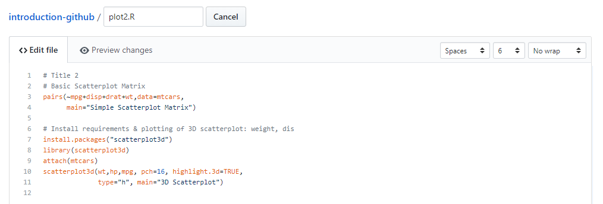

# Branches
The idea of branching is that we can create a copy of the project in which we can add a new feature. This branch is a completely separate version of your project and lives next to your original version. If the new feature is working properly we can merge it back into the project. It's a great way of testing new changes in some code when you're not sure whether it will work, and in the meanwhile not messing up the code that you already have. 


```{image} ../img/git/branching.png
:align: center
```


The original repository is always called the *master* branch.  

When a new GitHub repository is made, it's initialized by default with one branch: the *master* branch. All the changes in our project that we did so far, have hence always been in this master branch. Remember that when we did `git status` we read a line saying that we were on the master branch. 

If we would make a new branch, we can name it however we like (e.g. *new-feature*). There are two ways of doing this: locally or on the GitHub website. We will first show you the latter (section 2) and afterwards how to do it locally via Git Bash or the Terminal (section 4). 

A repository can have numerous branches. Branches are ways of organising work on a project: you can have a branch for a new feature, for trying out something new, for exploring an issue - anything at all.

It’s a good practice to create a new branch for every new bit of work you start doing, even if it’s a very small one. It’s especially useful to create a new branch for every new feature you start work on. Branches are of course disposable, you can always remove them. 

## Branching on GitHub
The easiest way is to make a new branch on GitHub. 
1. Click the button: 'Branch: master'
2. In 'Find or create a branch...' type `new-feature`
3. Click 'Create branch': new-feature


```{image} ../img/git/newbranch-github.PNG
:align: center
```


GitHub will now display in that button that it is on `Branch: new-feature`. It's very important to understand that any changes that happen in this branch, will not be visible in the master branch. 


```{admonition} Exercise 5
:class: note


Edit the `plot2.R` file again, however make sure you're in the *new-feature* branch. Add the following lines that will make a new plot. These lines will allow us to investigate the relation between the weight, horsepower and miles per gallon variables of `mtcars` dataset in R. 

```none
# Install requirements & plotting of 3D scatterplot
install.packages("scatterplot3d")
library(scatterplot3d)
attach(mtcars)
scatterplot3d(wt,hp,mpg, pch=16, highlight.3d=TRUE,
              type="h", main="3D Scatterplot")
```


```{admonition} Exercise 5
:class: note

<details markdown="1">
<summary> Solution
</summary>
Edit the file `plot2.R` by clicking on the pencil icon and add the following lines: 

 
Commit your changes with a useful commit message and save by clicking the green 'Commit changes'-button.

</details>
```

---

Switch back to your *master* branch and have a look to the `plot2.R`-file. It shouldn't contain the changes that we just made. 


## Merging branches on GitHub
Before exploring how we make branches on our computer locally, we'll merge the changes in the *new-feature* branch into the *master* branch. Test branches are merged into the master branch by making a **pull request**. In this section we will explain how to do a pull request. 

Whether you're on the *master* or *new-feature* branch, doesn't matter. In both cases you should see the following yellow screen. Alternatively, go to 'Pull requests' and find it there. 


```{image} ../img/git/pull-request-pre.PNG
:align: center
```

Click on 'compare & pull requests'. A new screen pops-up with the following information.

```{image} ../img/git/pull-request-1.PNG
:align: center
```


- The pull request should be interpreted as a request to pull the new branch and all of its changes into the master branch.   
- The base where it would be pulled towards is `base: master`. The branch where the changes are deriving from is `compare: new-feature`.   
- Note that GitHub checks the compatibility of the branches: in this case there are no conflicting edits and the branches can be merged together.   
- Give a descriptive title text and if appropriate some additional comment. 

Underneath the pull request related information, GitHub also gives you a summary of the changes that were done. 

---

```{image} ../img/git/pull-request-2.PNG
:align: center
```
---

- Each commit that's done in the branch *new-feature* (i.e. only added these 7 lines in this case)
- Display of the file and a visual representation of what changed in that commit. 

Click on 'Create pull request'. 

Finally, the last screen pops up in which you verify the merging commit and you give your consent to GitHub to merge both branches by clicking 'Merge pull request'.

---


```{image} ../img/git/pull-request-3.PNG
:align: center
```

---

It might be possible that in a project with several people, you're not authorized to make changes to the *master* branch. In this case you'll always have to work in a separate branch and someone else will get this last message. He or she will then decide whether this pull request should be merged. 

## Branching locally
Besides the possibility of making branches on GitHub, we can also do it locally on our computer. 

As we've made changes to the repository on GitHub, we'll start with pulling the changes into our local repository. Use `git pull` in your project folder. 
 
There is always an indication in the Terminal or Git Bash of which branch we're in (i.e. '(master)'). Here are the most important commands related to making branches and switching between different branches:
1. `git checkout -b <new-branch>`: will create a new branch and move into this branch. 
2. `git branch <new-branch>`: will create a new branch, but will remain in the current branch (i.e. the *master* branch in this case)
3. With `git checkout <branch>` we will switch from one branch to the other. 
4. Listing all the existing branches is possible with `git branch -a`:

Let's start with listing all the existing branches (4). 

```none
* master
remotes/origin/HEAD -> origin/master
remotes/origin/master
remotes/origin/new-feature
```

The first branch is our local master branch in which we're working at the moment (as denoted by the asterisk \*). The three others relate to the branches that exist remotely on GitHub. If we want to work on the branch *new-feature* we will have to import it first with: `git checkout new-feature` (3). Git will understand that there is a remote branch with the same name and you want to work on this one. 

**Note** that if you use `git checkout -b new-feature` (2), you would have created a new branch with the same name as the remote branch. This is error prone and will lead to problems! 

### Example workflow
An example workflow is depicted in the figure below and is discussed in the following points. 

---

```{image} ../img/git/conceptual_areas_branching.png
:align: center
```

---

**1. Make a new branch:**

```
git checkout -b <new-branch>
```

Git will make a new branch with the name `<new-branch>` and tell you it switched to the new branch. If you want to change branches, just type `git checkout` followed by the name of the branch, e.g. `git checkout master`.

**2. Make the necessary changes:**
  - Add  a new file
  - Add new code to an existing file

**3. Stage changes:**  
Use the following  command to simply add all the new or changed files. 

```
git add .
```
 
**4. Commit staging area:**  
Commit all the staged files with:

```
git commit -m "some useful commit message"
```

**5. Push commits to GitHub:**

```
git push origin <new-branch>
```  

or alternatively:

```
git push --set-upstream origin <new-branch>
```

The `git push` command is now a bit longer. The first time we want to publish a new local branch on a remote repository (GitHub), we need to be explicit and tell Git to add the `<new-branch>` to the origin. In Git, the "origin" is used to refer to the GitHub original repository's URL and makes it much easier to talk about. 

Next time you want to push your commits from *new-branch*, you won’t need to be explicit - you can simply do `git push`, because now *new-branch* exists on GitHub and both branches know how to commmunicate with each other. However, it’s still a good idea to be explicit. That way it'll be less likely to push something to the wrong branch.


---

```{admonition} Exercise 6
:class: note

Make a new branch and make sure you're in the branch. Edit the README.md file slightly. Once the changes have been committed and pushed, create a pull request and merge the changes into the master branch.  
 

<details markdown="1">
<summary> Solution
</summary>

```none
git checkout -b readme

# Edit the README.md file
git add README.md
git commit -m "changed README file completely"
git push origin readme
# Find the new branch in your GitHub repository. From there the solution is identical as discussed here above. 

```
</details>


---

## Deleting branches 

### Via GitHub

If a branch is of no more use, we can delete it. To find all the existing branches:
1. In the new GitHub website, click on *branches* in the upper right of the repository (right underneath Clone)
---

```{image} ../img/git/deleting-branch-1-update.PNG
:align: center
```

---
2. In the slightly older version, click on *branches* in the area depicted in figure below

---

```{image} ../img/git/deleting-branch-1.PNG
:align: center
```


---


After successfully merging our changes in the branch created during the exercise above, it can be deleted. Click on the waste bin:

---


```{image} ../img/git/deleting-branch-2.PNG
:align: center
```

---

Go back to the main tab of the repository and find that the branch has been deleted. 


### Locally

Deleting a branch is as simple as typing the following command:

```
git branch -d <name-of-the-branch>
```

If git refuses to do so, there is a forced way to do it as well by using the capital `-D` parameter. 