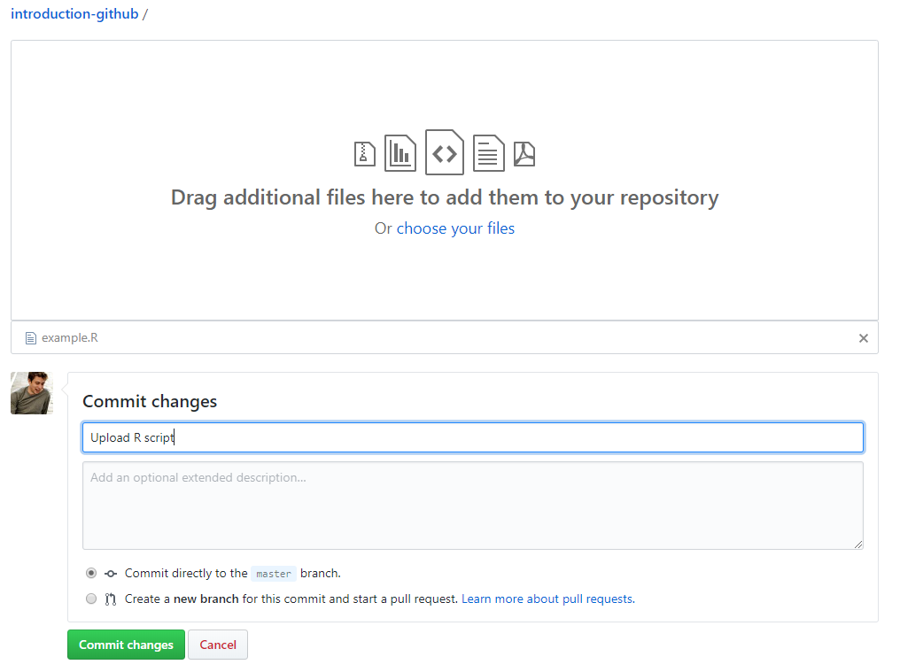

# Routine usage

As mentioned in the first chapter, there are three conceptual areas in Git: the development area, the staging area and the commit repository. The routine usage is depicted in the figure below. When we want to save a file from the development area on our computer to the commit repository, we'll always have to add it to the staging area first, before we can commit it. The usual routine looks like this: 

```
git add <file>
git commit -m "some text that explains what has changed"
```

These commands will subsequently add the file `<file>` to the staging area and then commit it to the commit repository. If we wouldn't pass along the `-m`-message parameter, Git would have opened your editor where you write the commit message. It's good practice to write a short, but powerful commit message that helps your future self to determine what has changed in this commit. 

Uptil now we kept track of our code locally on our computer. Imagine that you lose your computer now, you've also lost your project (and all the files in it). A bit less drastical, if you would just like to show your project to your colleagues or with the whole world, we need one more step. The last part of our routine usage would be to **push** the commit(s) to an online repository on GitHub. Here's how it looks like:

```
git push
```

With this command we can update our online repository on GitHub with the commits we have done on our computer locally. 

That's all you need to know: `add-commit-push`. 


```{image} ../img/git/conceptual_areas_push.png
:align: center
```


Before we can start adding, committing and pushing, we have to start a version controlled project/repository. There are two ways of **initializing a new Git repository** which only has to be performed once right at the start:
- Clone a GitHub repository (from GitHub): see Section 2
- Initialize Git on a folder on your computer: see Section 4   
Both options will work fine and depends on your preferences or maybe the situation of the project. The first option can be used if you're about to start a new project, the second option can be used when you already have some files in a project which you now want to start version controlling. 


## Create a new repository from GitHub

Go to your GitHub homepage and click on the '+' icon in the upper right corner and select 'New repository'. The following screen will pop up.


```{image} ../img/git/02-2-create-repository.PNG
:align: center
```


We already filled in a repository name and an optional description. You can choose to already publish your repository, however as this is a meaningless repository, we will choose not to. When you're about to start a new project, there are three things to consider:
- For a new repo, it's a good practice to initialize the repo with a README file. This file will eventually include a decscription about the repository and all of the code or files in it (e.g. information about the scripts, version, disclaimers, etc.)
- Adding an `.ignore` file is something we will cover later, however for now it suffices to know that the .ignore file will contain some code which tells git to exclude certain files which reside in your local folders from uploading to the external GitHub repo.
- Adding a license makes sense when your project becomes public. It defines under which license the content is made available.

In our case, we will initialize the repository with a README file and click 'Create repository', which will then look like this:


```{image} ../img/git/02-3-create-readme-repository.PNG
:align: center
```

This is the home directory of a GitHub repository. From here we can already do a lot, like changing or uploading files. We initialized a GitHub repository with a README file and we can see that we have only one file in this repository: the README file. By default the text in this README file is the title of the repository and the description that we created here above. A README file is basically a text file with some explanation related to the repository. For example, what the code is all about, how to use it, how to acknowledge the developers, etc. Notice that it's a Markdown-file as we can see by the .md extension. An ordinary text file on your computer has a .txt extension or a word file has docx. More information related to markdown can be accessed from the Github guides [here](https://guides.github.com/features/mastering-markdown/). 


If you want to make a local copy of the repository, we have to **clone** it to our computer. Click on the green button 'Clone or download' and copy the link.  Within the Git Bash (or Terminal), navigate to the folder where you want to keep your project folder and type the following:

```
git clone <link>

```
with `<link>` being the link from GitHub. 


```{admonition} Exercise 1
:class: note

Create a new GitHub repository, give it a name and initialize it with a `README`-file. Upload the file `plot1.R` to the repository on GitHub. What is GitHub asking you to do? Which stage is omitted when uploading a file directly to GitHub?  

Clone the repository to your computer. How many files are there in your local repository?

<details markdown="1">
<summary> Solution
</summary>
Click on upload files and drag the file into the screen. GitHub is asking to add a commit message which defines the changes that you'll do to your repository. In this case we'll add the very brief *Upload R script* message. Notice that there is no staging area when you upload a file directly on GitHub. 



Click on 'Commit changes' and find the two files: `README.md` and `example.R` in your repository. Now, we can find the clone link via the green 'Clone or download' button. In our Terminal we type the following command to start using the repository locally on our computer: `git clone <link>` in which you change `<link>` to the link that you copied from GitHub. There should be two files in your local repository as well.   
On a Windows computer we have a folder that contains the following files:


</details>

```


## Our first commit
Our local copy (clone) of the GitHub repository is now able to communicate with the GitHub repository. Every change within this repository is traceable, whether it is a new file or changes to a file. When you make changes in your local repo (e.g. create a new file), you have to add the file to the staging area first (`git add`) and then commit it (`git commit`) before pushing it (`git push`) to your GitHub website repo. 


### Staging
Let's add a new file to our folder on our computer locally. Download the file 'git-introduction/plot2.R' and add it in the folder where also the `plot1.R` file is located. It contains some R code for plotting a new figure.  

The first thing we'll have to do now is to stage the file into the staging area.  Remember that this is an intermediate area before committing the file to the repository. In a next section we will learn why this staging area can be useful. 

Now we have two options, depending on the situation:
  1. `git add <file>` : will add a **specific** file to the staging area
  2. `git add .` : will add **all** the changed or new files to the staging area

In this case, we can choose either of both options as we have only added one file. As this is a new file, `git add` will not only add it to the staging area, but it will also tell Git that it needs to keep track of changes that happen in this file. 

### Committing
Our new file is now in the staging area, ready to be committed. For this we have to use the following command:
```
git commit -m "added plot2.R script"
```
We added a parameter `-m` (message) to the command followed by some text. This text informs our future selves of what changes were done. We make this message as explanatory as possible, yet as short as possible. If the `-m` parameter was not added, git will launch a text editor and ask to write a message. Some tips and general best practices in writing commit messages are described in [this link](https://chris.beams.io/posts/git-commit/). 

```{admonition} Question
:class: hint

Which of the following commit messages would be most appropriate for a hypothetical commit made to our `README.md` file?
- “Update README file”
- “Added line ‘We use this repo as an example’ to README.md”
- “Added purpose description to the README file”

<details markdown="1">
<summary> Solution
</summary>

One can argue on the appropriatness of commit messages as it is subjective. In this case however, the third options seems most ideal. It's both not too generic and not too specific. 
</details>
```

```{admonition} Question
:class: hint

What has happened after committing?
- We saved a version of the file which is now visible on GitHub.com
- We saved a version of the file which is now stored in our commit repository

<details markdown="1">
<summary> Solution
</summary>
We've been working locally uptil now and didn't push the commits to the GitHub repository, hence it's still in our commit repository. 

</details>
```


### Push commits to GitHub
Recall that when we added the first file on GitHub (exercise 1), it was immediately committed and showed up right away in the GitHub repository. Unfortunately, when we've changed some files locally and we commit them to our commit repository, GitHub doesn't know this yet. Hence, we have to do one final step: 
```
git push
```
Have a look on your GitHub repository and verify that the new file is now in your repository. 


### Stage-commit-push
We've learned how to make a GitHub repository, clone it to our computer, add a file, commit it and push it back to GitHub. This is everything you need to know for a routine usage of Git(Hub) on one of your projects. In order to grasp this concept a bit better, we'll repeat it by making changes on both files in the next exercise. 


```{admonition} Exercise 2
:class: note

Add a title to both files ("# Title plot 1" and "# Title plot 2"). You can choose how you do this: e.g. open the files in a text editor and add the line on top of the file. Follow the steps here above to push your changes to our GitHub repository. 


<details markdown="1">
<summary> Solution
</summary>
After adding the titles, use the following commands. Here we used a `.` after `git add` because we want to add both changes to the staging area.

```none
git add .
git commit -m "Added a title to both plot files"
git push
```

</details>


### Commit all tracked files at once
One thing we haven't really said until now is that Git actually keeps track of the changes that you make to files as soon as you have told Git to do so. The first thing you have to do when you add a new file, is to tell Git to keep track of changes made in this file. If you do not do this, Git will know that there is a new file, but it will classify it as *untracked*. After adding it to the staging area a first time, it will always keep track of the changes in this file. 

On the premise that Git is already keeping track of the files, you can simply do `git commit -a -m "some informative text"` in which `-a` stands for add all changes in all files to the staging area and commit them at once. 


## Create a new repository from your computer
As discussed here above, you can also create a repository from your computer. The command that we use for this is:
```
git init
```

The first thing we have to do is to make a new folder which will contain the files of the project in case you don't have one yet. In Git Bash (Windows) or in your Terminal (Mac, Linux), move to the project folder you just created or to the folder that contains the files of a project. 

- When you're in that folder, you have to type `git init` to initialize a Git repository.  
- Open GitHub.com, create a new repository and DO NOT initialize it with a README.md, .gitignore or license. You can add that later. 
- Go back to your Terminal and use the following commands to make a link between your local repository and the repository on GitHub: 
  ```
  git remote add origin https://github.com/<username>/<repository>.git
  ```
  Notice that this link can also be found from the green 'Clone or download' button on GitHub.
- Add the file(s) in your folder to the staging area, commit it and push it to GitHub with the following commands:
```
git add <file>
git commit -m "some text"
git push -u origin master
```

It is important to note that `git init` will keep track of all the subdirectories and their files that are in the folder. Thus, you don't need to create a git repository for each folder or subdirectory. Git repositories can interfere with each other if they are “nested”: the outer repository will try to version-control the inner repository. This will lead to errors.

If we use `ll` or `ls -a` we get a list of all files and directories, and we see that a `.git` folder is now present. Git uses this special directory to store all the information about the project like the history of all commits. If we ever delete the `.git` sub-directory, we will lose the project’s history. 


Before starting with the next exercise we also want to stress the importance of not uploading data to GitHub. It's good practice to have links to data, however not the data itself. GitHub is not your next cloud storage instance. 

```{admonition} Exercise 3
:class: note

Find a folder on your computer with some files that you want to version control, initialize Git on that folder and make it (privately) available on GitHub. 
 
<details markdown="1">
<summary> Solution
</summary>
See the steps in the previous section.  
</details>
```


## The strength of the staging area
Now you're probably wondering why it's useful to have that many steps to save a file (add, commit, push). We will give a practical example based on the figure below: 


```{image} ../img/git/staging_area.png
:align: center
```

Imagine that you're working on a project with multiple Python scripts and you're working on all of them. In this case your folder in your development area contains the files  `scriptA.py`, `scriptB.py` and `scriptC.py`. The changes that you made in script A and script C are somehow related, but script B is not. It's good practice to make commits in which changes that are related to each other are bundled. Hence, in this case we want to make one commit with the changes from file A and C. Now we can simply add scripts A and C to the staging area and commit it. The changes in script B will remain unsaved until we commit the changes in a separate commit. 

It's always better to have more commits; in case you want to remove part of your work in a later stage, or you want to start your work again from a specific commit. 


## Pull
Imagine that you change something in a file on GitHub, or upload a new file online via GitHub. We would want this change to appear locally as well. For this we need to use the `pull` command to pull the updates in. 

Let's go back to our repository on GitHub.com. We will make a change in the repository on GitHub and then pull these changes back into the repository on our computer (i.e. the project folder on our computer). 

Click on the `README.md` file in the list of files and click the pencil icon on the upper right. The file will open in an editor mode and we can change the title from *introduction-github* to *Introduction GitHub* or we can add some more descriptive text. Note that a README file is by default a markdown-file. Markdown is a text file with lay-outing options. If you haven't heard of it before, it's worth some [further reading](https://guides.github.com/features/mastering-markdown/).

Save the changes by committing them as depicted here below:


```{image} ../img/git/commitReadme.PNG
:align: center
```


GitHub is now one commit ahead of our local repository. Hence, we have to pull this commit into our local repository. We can do this by using the following command:
```
git pull
```

Open the file `README.md` and check whether the changes have merged in.  